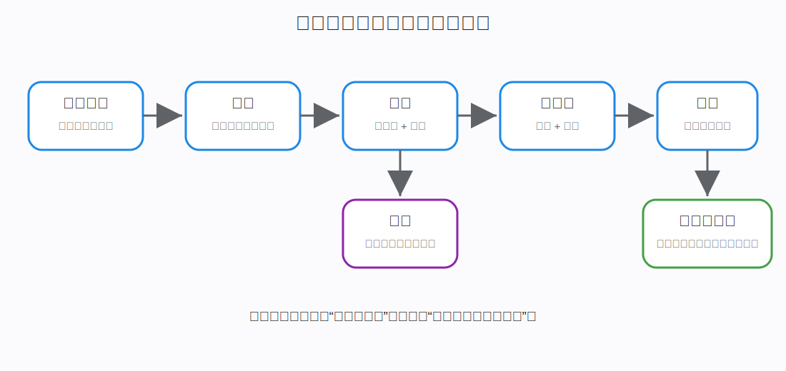
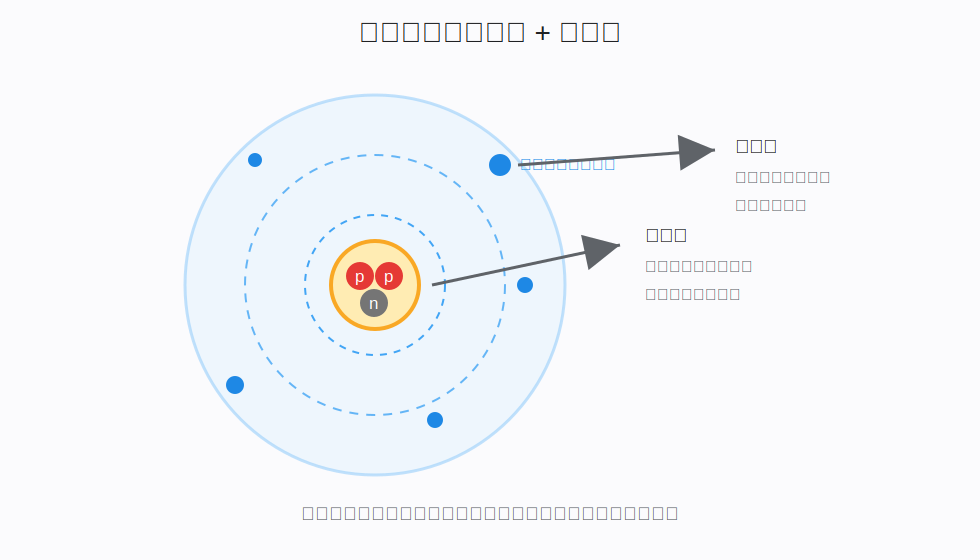
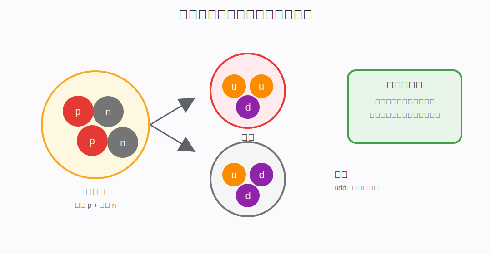
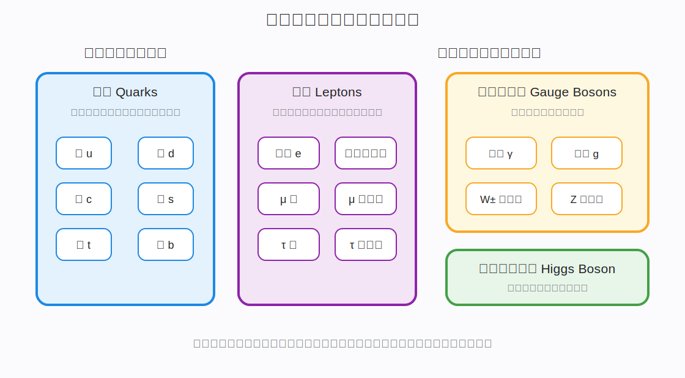
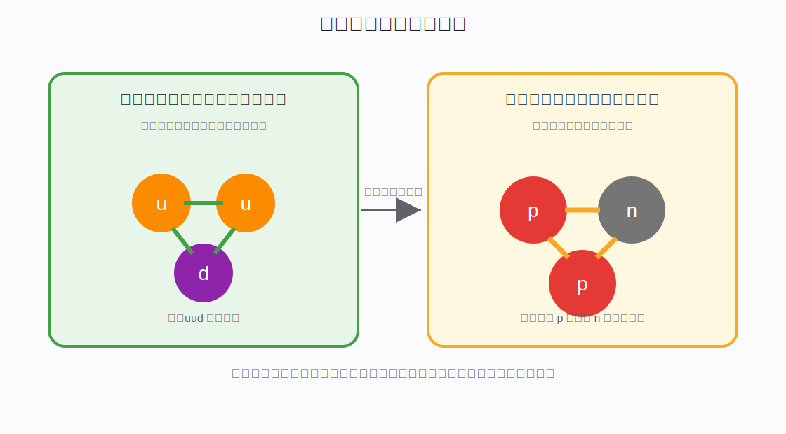
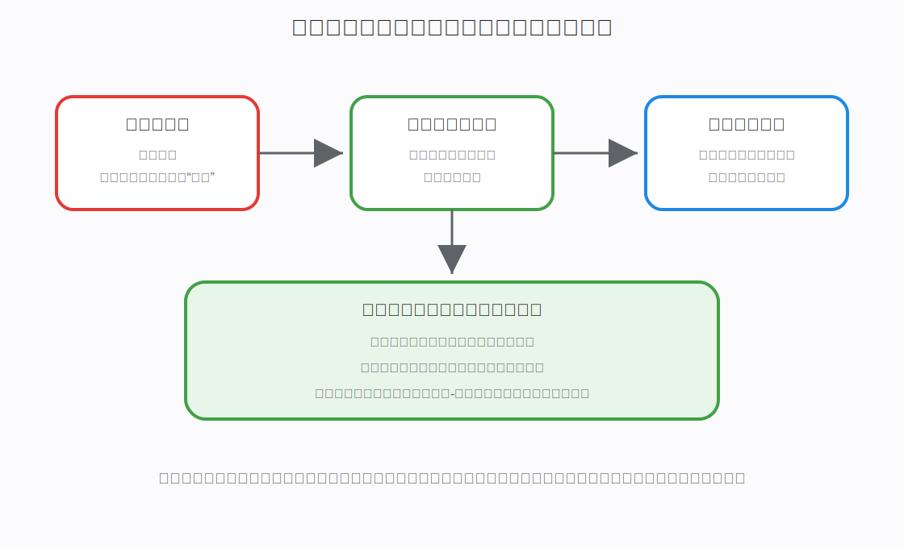

# 从微观角度理解物质：原子、粒子与相互作用

## 一、为什么要从微观角度理解物质

我们日常看到的世界是宏观的：

- 石头很硬。
- 水会流动。
- 空气看不见但能感受到。
- 金属可以导电。
- 火焰会发光发热。
- 人体由血肉、骨骼和器官组成。

但这些现象背后都有微观原因。

例如：

- 水为什么会流动？因为水分子之间可以相对移动。
- 冰为什么是固体？因为水分子形成了比较稳定的排列结构。
- 金属为什么导电？因为金属中有大量可以移动的电子。
- 盐为什么能溶于水？因为离子和水分子之间存在电磁相互作用。
- 太阳为什么发光？因为原子核发生聚变，释放能量。

所以从微观角度看，物质不是连续的一整块，而是由不同层级的微观粒子组成，并通过不同相互作用形成结构。

这篇文章的主线是：

```text
宏观物质
  ↓
分子
  ↓
原子
  ↓
原子核 + 电子
  ↓
质子 + 中子
  ↓
夸克
  ↓
基本粒子和基本相互作用
```



## 二、先建立一张微观世界地图

在继续深入之前，先给出一个整体结论：

> 普通物质主要由原子构成；原子由原子核和电子构成；原子核由质子和中子构成；质子和中子由夸克构成；电子和夸克目前在标准模型中被视为基本粒子。

这里有几个关键词：

- **普通物质**：指我们日常接触的物质，例如水、空气、石头、人体、金属。
- **原子**：化学意义上保持元素性质的基本单位。
- **原子核**：原子中心极小但质量高度集中的部分。
- **电子**：带负电的轻子，决定原子外层结构和化学性质。
- **质子**：带正电，决定元素种类。
- **中子**：不带电，影响原子核稳定性和同位素。
- **夸克**：构成质子和中子的更基本粒子。
- **基本相互作用**：让粒子之间发生吸引、排斥、束缚、衰变等关系的根本机制。

学习时不要只记“谁由谁组成”，还要追问：

1. 这个粒子是什么？
2. 它带不带电？
3. 它有没有质量？
4. 它和谁发生相互作用？
5. 它在物质结构中起什么作用？

## 三、分子：多个原子组成的微观结构

### 3.1 什么是分子

分子（Molecule）是由两个或多个原子通过化学键结合形成的相对稳定结构。

例如：

| 物质   | 分子或结构     |
| ---- | --------- |
| 水    | `H2O`     |
| 氧气   | `O2`      |
| 二氧化碳 | `CO2`     |
| 甲烷   | `CH4`     |
| 葡萄糖  | `C6H12O6` |

水分子由两个氢原子和一个氧原子组成：

```text
H + O + H -> H2O
```

### 3.2 分子为什么能稳定存在

分子稳定存在的原因是原子之间形成了化学键。

化学键本质上主要来自电磁相互作用：

- 原子核带正电。
- 电子带负电。
- 原子核吸引电子。
- 不同原子的电子云和原子核之间相互作用。
- 系统会倾向于形成能量更低、更稳定的结构。

所以化学键不是“胶水”，而是带电粒子之间的电磁相互作用形成的稳定结构。

### 3.3 分子和物质性质的关系

物质的许多性质来自分子结构。

例如：

- 水分子有极性，所以水能很好地溶解许多离子化合物。
- 蛋白质分子结构复杂，所以能执行生命功能。
- 塑料分子是长链结构，所以有柔韧性。
- 金刚石和石墨都由碳原子组成，但原子排列方式不同，性质完全不同。

这说明：

> 物质性质不仅取决于“有什么原子”，还取决于“这些原子如何连接和排列”。

## 四、原子：普通物质的基本结构单元

### 4.1 什么是原子

原子（Atom）是化学元素保持自身性质的基本单位。

例如：

- 一个氢原子仍然是氢。
- 一个氧原子仍然是氧。
- 一个铁原子仍然是铁。

如果继续把原子拆开，变成原子核、电子、质子、中子、夸克，那么它就不再保持原来元素的化学性质。

### 4.2 原子由什么组成

原子由两大部分组成：

```text
原子 = 原子核 + 电子
```



其中：

- 原子核位于原子中心，非常小，但集中了几乎全部质量。
- 电子分布在原子核周围，形成电子云。

需要注意：

> 电子不是像行星绕太阳那样沿固定轨道绕原子核运动。更准确地说，电子在原子中表现为一种概率分布，称为电子云或原子轨道。

### 4.3 原子为什么通常是电中性的

原子核中的质子带正电，电子带负电。

普通中性原子满足：

```text
质子数 = 电子数
```

例如：

| 原子   | 质子数 | 中性原子的电子数 |
| ---- | --- | -------- |
| 氢 H  | 1   | 1        |
| 碳 C  | 6   | 6        |
| 氧 O  | 8   | 8        |
| 铁 Fe | 26  | 26       |

正负电荷数量相等，所以整体不显电性。

### 4.4 每个原子都有电子吗

正常环境中的中性原子都有电子。

但在特殊情况下，原子可以失去电子，变成离子：

```text
钠原子 Na 失去 1 个电子 -> Na+
氯原子 Cl 得到 1 个电子 -> Cl-
```

如果一个原子失去全部电子，只剩原子核，就不再是完整中性原子，而是完全电离的离子或裸原子核。

这种情况可能出现在：

- 高温等离子体。
- 恒星内部。
- 粒子加速器。
- 高能物理实验。

所以准确说：

> 普通中性原子一定有电子；但在高温、高能等特殊条件下，原子可以失去部分或全部电子。

## 五、原子核：原子的质量核心

### 5.1 什么是原子核

原子核（Atomic Nucleus）是位于原子中心的极小结构，由质子和中子组成。

```text
原子核 = 质子 + 中子
```

质子和中子统称为核子（Nucleons）。



### 5.2 原子核有多小

原子核非常小。

如果把一个原子放大到体育场那么大，原子核可能只像中心的一粒小豆子，而电子云分布在巨大的空间范围内。

这说明：

- 原子大部分空间不是实心物质。
- 原子核极小。
- 但原子核集中了几乎全部质量。

### 5.3 原子核为什么能稳定存在

原子核中有多个质子，而质子都带正电。

按电磁相互作用：

```text
正电荷和正电荷应该相互排斥
```

那为什么原子核不会立刻散开？

因为在原子核尺度上，存在更强的相互作用：强相互作用。

强相互作用可以在极短距离内把质子和中子束缚在一起，抵抗质子之间的电磁排斥。

这里的“强”不是形容词随便说说，而是物理学中的一种基本相互作用。它的核心意思是：

> 在极小的原子核尺度内，有一种比电磁排斥更强的作用，会把夸克束缚成质子和中子，也会让质子、中子在原子核中紧密结合。

可以用一个生活化类比理解：

```text
多个带正电的质子像互相排斥的人
  ↓
电磁力让它们想分开
  ↓
强相互作用像短距离内非常强的“束缚力”
  ↓
只要距离足够近，它就能把质子和中子拉在原子核里
```

可以理解为：

```text
电磁力：质子之间相互排斥
强相互作用：把核子紧紧束缚在一起
```

不过强相互作用有一个关键特点：**作用距离极短**。它不像引力、电磁力那样可以影响很远的距离。它主要在原子核这种极小尺度内明显，一旦距离稍微变大，束缚效果就会迅速减弱。

原子核稳定与否，取决于质子数、中子数、核力、电磁排斥等因素的平衡。

## 六、质子：决定元素种类的粒子

### 6.1 什么是质子

质子（Proton）是原子核中的一种核子，带正电。

它的电荷量为：

```text
+1 个基本电荷
```

这里的“+1”是相对于电子电荷量的大小定义的。电子带 `-1`，质子带 `+1`。

### 6.2 质子数决定元素

一个原子是什么元素，由原子核中的质子数决定。

例如：

| 质子数 | 元素 |
| --- | -- |
| 1   | 氢  |
| 2   | 氦  |
| 6   | 碳  |
| 8   | 氧  |
| 26  | 铁  |
| 79  | 金  |

只要质子数是 6，它就是碳；只要质子数是 8，它就是氧。

如果质子数变了，元素种类就变了。

### 6.3 质子由什么组成

质子不是基本粒子，它由三个夸克组成：

```text
质子 = 上夸克 + 上夸克 + 下夸克
```

简写为：

```text
质子 = uud
```

上夸克电荷是 `+2/3`，下夸克电荷是 `-1/3`。

所以质子总电荷是：

```text
+2/3 + +2/3 + -1/3 = +1
```

这就是质子带正电的微观来源。

## 七、中子：影响原子核稳定性的粒子

### 7.1 什么是中子

中子（Neutron）也是原子核中的核子，但整体不带电。

它和质子质量接近，但电荷不同：

| 粒子 | 电荷 | 位置   |
| -- | -- | ---- |
| 质子 | +1 | 原子核内 |
| 中子 | 0  | 原子核内 |
| 电子 | -1 | 原子核外 |

### 7.2 中子的作用

中子在原子核中非常重要。

它可以：

- 增加强相互作用的束缚效果。
- 降低质子之间电磁排斥带来的不稳定。
- 决定同位素种类。
- 影响原子核是否容易发生衰变。

对于较重原子核，仅靠质子很难稳定存在，需要足够数量的中子帮助维持核结构。

### 7.3 中子由什么组成

中子也不是基本粒子，它由三个夸克组成：

```text
中子 = 上夸克 + 下夸克 + 下夸克
```

简写为：

```text
中子 = udd
```

总电荷为：

```text
+2/3 + -1/3 + -1/3 = 0
```

所以中子整体不带电，但它内部仍由带分数电荷的夸克组成。

## 八、电子：决定化学性质和电现象的关键粒子

### 8.1 什么是电子

电子（Electron）是一种带负电的基本粒子，属于轻子。

它有几个关键特点：

- 带负电。
- 质量很小，远小于质子和中子。
- 不参与强相互作用。
- 会参与电磁相互作用、弱相互作用和引力相互作用。
- 在目前标准模型中，电子被认为是基本粒子，没有已知内部结构。

### 8.2 电子在原子中做什么

电子分布在原子核周围，形成电子云。

电子决定了很多化学性质：

- 原子如何形成化学键。
- 原子是否容易失去电子。
- 原子是否容易得到电子。
- 分子的形状和反应能力。
- 材料是否导电。

简单说：

> 原子核决定“这是什么元素”，电子结构决定“它如何和别的原子发生化学关系”。

### 8.3 为什么化学主要和电子有关

普通化学反应通常不会改变原子核。

化学反应主要改变：

- 电子的分布。
- 原子之间的化学键。
- 分子结构。

例如氢气和氧气反应生成水：

```text
2H2 + O2 -> 2H2O
```

反应中，氢原子和氧原子的原子核没有变成别的元素，主要是电子重新分布，形成新的化学键。

所以化学变化的本质是电子结构变化。

## 九、离子：电子数量改变后的原子或原子团

### 9.1 什么是离子

离子（Ion）是带电的原子或原子团。

当原子失去或得到电子时，就会变成离子。

```text
失去电子 -> 正离子
得到电子 -> 负离子
```

例如：

```text
Na -> Na+ + e-
Cl + e- -> Cl-
```

钠离子和氯离子通过电磁吸引形成氯化钠晶体，也就是食盐。

### 9.2 离子和原子的区别

| 对比   | 原子      | 离子           |
| ---- | ------- | ------------ |
| 电性   | 通常整体中性  | 带正电或负电       |
| 电子数  | 等于质子数   | 不等于质子数       |
| 形成原因 | 正负电荷平衡  | 失去或得到电子      |
| 例子   | Na、Cl、O | Na+、Cl-、Ca2+ |

注意：

> 离子不是“坏掉的原子”，而是电子数发生变化后形成的稳定或半稳定带电粒子。

## 十、同位素：质子数相同，中子数不同

### 10.1 什么是同位素

同位素（Isotope）是指质子数相同、中子数不同的原子。

因为质子数相同，所以它们属于同一种元素。

例如氢有几种常见同位素：

| 名称 | 质子数 | 中子数 |
| -- | --- | --- |
| 氕  | 1   | 0   |
| 氘  | 1   | 1   |
| 氚  | 1   | 2   |

它们都是氢，因为质子数都是 1。

### 10.2 同位素为什么重要

同位素影响原子核性质。

有些同位素稳定，有些同位素不稳定，会发生放射性衰变。

例如：

- 碳-12 稳定。
- 碳-14 不稳定，会发生衰变，可用于考古测年。
- 铀-235 可用于核裂变。

所以：

> 元素种类由质子数决定，同位素差异由中子数决定。

## 十一、夸克：组成质子和中子的更基本粒子

### 11.1 什么是夸克

夸克（Quark）是标准模型中的基本粒子之一。

目前已知有六种夸克：

| 中文名 | 符号 | 英文      |
| --- | -- | ------- |
| 上夸克 | u  | up      |
| 下夸克 | d  | down    |
| 粲夸克 | c  | charm   |
| 奇夸克 | s  | strange |
| 顶夸克 | t  | top     |
| 底夸克 | b  | bottom  |

日常普通物质主要依赖上夸克和下夸克，因为质子和中子主要由它们组成。

### 11.2 夸克为什么不会单独出现

夸克有一个很特别的性质：禁闭。

通俗理解：

> 夸克不能像电子那样被单独拿出来长期自由存在，它们总是被强相互作用束缚在强子内部。

质子和中子属于强子。

当你试图把两个夸克拉开，强相互作用并不会像普通弹簧那样越来越弱，而会表现出很强的束缚效果。能量足够大时，反而会产生新的夸克-反夸克组合，而不是得到一个孤立夸克。

### 11.3 夸克如何组成质子和中子

最常见的组合：

```text
质子 = u + u + d
中子 = u + d + d
```

电荷计算：

```text
u = +2/3
d = -1/3

质子 uud = +2/3 + +2/3 - 1/3 = +1
中子 udd = +2/3 - 1/3 - 1/3 = 0
```

这说明质子和中子的电性来自内部夸克电荷的组合。

## 十二、轻子：电子和中微子所在的家族

### 12.1 什么是轻子

轻子（Lepton）是一类基本粒子，不参与强相互作用。

常见轻子包括：

- 电子。
- μ 子。
- τ 子。
- 电子中微子。
- μ 中微子。
- τ 中微子。

电子是我们日常最熟悉的轻子。

### 12.2 中微子是什么

中微子（Neutrino）是一类非常轻、几乎不带电、很难和物质发生作用的粒子。

它们可以穿过大量物质而几乎不被拦住。

太阳内部核反应、核衰变、超新星爆发都会产生大量中微子。

中微子难以探测，但它们是现代粒子物理和宇宙学的重要研究对象。

### 12.3 电子为什么比中微子更常见于化学和电学

因为电子带电，会强烈参与电磁相互作用。

而中微子不带电，只通过弱相互作用和引力相互作用参与过程，所以对普通化学、电路、材料性质影响极弱。

所以日常物质结构中，电子是关键角色。

## 十三、玻色子：传递相互作用的粒子

### 13.1 什么是玻色子

在标准模型中，很多相互作用可以理解为通过玻色子传递。

常见规范玻色子包括：

| 粒子    | 主要作用     |
| ----- | -------- |
| 光子    | 传递电磁相互作用 |
| 胶子    | 传递强相互作用  |
| W 玻色子 | 参与弱相互作用  |
| Z 玻色子 | 参与弱相互作用  |

此外还有希格斯玻色子，它和基本粒子的质量来源有关。



### 13.2 光子是什么

光子（Photon）是电磁相互作用的媒介粒子，也是光和电磁波的量子。

它有几个特点：

- 没有静止质量。
- 以光速传播。
- 携带能量和动量。
- 参与电磁相互作用。

可见光、红外线、紫外线、无线电波、X 射线、γ 射线本质上都是电磁波，只是频率和能量不同。

### 13.3 胶子是什么

胶子（Gluon）是强相互作用的媒介粒子。

它把夸克束缚在一起，使夸克组成质子、中子等强子。

胶子的作用可以粗略理解为：

> 夸克之间靠胶子传递强相互作用，因此不能随意分离。

### 13.4 W、Z 玻色子是什么

W 玻色子和 Z 玻色子参与弱相互作用。

弱相互作用可以导致粒子类型发生变化。

例如某些 β 衰变过程中，中子可以转变为质子，同时放出电子和反中微子：

```text
n -> p + e- + 反电子中微子
```

这类过程对放射性、太阳核反应、粒子衰变非常重要。

### 13.5 希格斯玻色子是什么

希格斯玻色子和希格斯场有关。

通俗理解：

> 某些基本粒子通过和希格斯场相互作用获得质量。

这不是说希格斯玻色子“组成了质量”，而是说希格斯机制解释了部分基本粒子为什么具有静止质量。

## 十四、反粒子：每种粒子都有对应反粒子吗

很多粒子都有对应的反粒子。

例如：

| 粒子 | 反粒子 |
| -- | --- |
| 电子 | 正电子 |
| 质子 | 反质子 |
| 中子 | 反中子 |
| 夸克 | 反夸克 |

反粒子和对应粒子质量相同，但某些性质相反，例如电荷相反。

电子带负电，正电子带正电。

当粒子和反粒子相遇时，可能发生湮灭：

```text
电子 + 正电子 -> 光子 + 光子
```

这体现了物质和能量之间的深层关系。

## 十五、四种基本相互作用：粒子之间关系的根本原因

只知道粒子种类还不够。真正让物质形成结构的是相互作用。

自然界目前已知四种基本相互作用：


### 15.1 强相互作用

强相互作用主要负责：

- 把夸克束缚成质子、中子等强子。
- 把质子和中子束缚成原子核。

它在原子核尺度非常强，但作用距离非常短。

更准确地说，强相互作用可以分成两个层次理解。



#### 15.1.1 强相互作用是怎么产生的

强相互作用不是由普通电荷产生的，也不是由质子“带正电”产生的。

它来自夸克具有的一种特殊属性：**色荷（Color Charge）**。

这里的“色”不是真实颜色，不是红色、绿色、蓝色的视觉颜色，而是物理学借用颜色名称来标记强相互作用中的一种“荷”。它类似于电磁相互作用中的电荷：

```text
电磁相互作用：电荷 -> 电磁场 -> 光子传递作用
强相互作用：色荷 -> 强力场 -> 胶子传递作用
```



可以这样理解：

1. 夸克带有色荷。
2. 色荷会激发强相互作用对应的场，也就是强力场。
3. 夸克之间通过胶子交换和强力场发生作用。
4. 这种作用把夸克牢牢束缚在一起，形成质子、中子等强子。

所以，强相互作用的产生逻辑是：

```text
夸克具有色荷
  ↓
色荷引发强力场
  ↓
胶子在夸克之间传递强相互作用
  ↓
夸克被束缚成质子、中子等强子
```

#### 15.1.2 胶子为什么重要

胶子（Gluon）是强相互作用的媒介粒子。

如果用电磁作用类比：

```text
带电粒子之间通过光子传递电磁相互作用
带色荷的夸克之间通过胶子传递强相互作用
```

但强相互作用比电磁作用更复杂。

光子本身不带电，所以光子之间通常不会直接发生电磁相互作用。胶子不一样，胶子本身也带色荷，因此胶子之间也能相互作用。

这会导致强相互作用有一个非常反直觉的特点：

> 夸克之间距离变大时，强相互作用不会像电磁力那样简单减弱，反而会形成越来越强的束缚效果。

这就是夸克禁闭的重要原因。

#### 15.1.3 为什么夸克不能被单独拉出来

如果试图把质子里的一个夸克拉出来，强力场中储存的能量会越来越多。

当能量足够大时，系统不会给你一个孤立夸克，而是会用这些能量产生新的夸克和反夸克。

结果类似：

```text
试图拉开一个夸克
  ↓
强力场能量增加
  ↓
能量足够大
  ↓
产生新的夸克-反夸克对
  ↓
形成新的强子
```

所以实验中看到的是一束强子，而不是单独夸克。

这就是**夸克禁闭（Quark Confinement）**：

> 夸克不能长期以孤立自由粒子的形式存在，只能被束缚在强子内部。

#### 15.1.4 强相互作用和核力是什么关系

强相互作用最根本地发生在夸克和胶子层面。

但质子和中子不是基本粒子，它们内部由夸克和胶子组成。质子、中子之间还能表现出强相互作用残留下来的效果，这就是核力，也叫残余强相互作用。

关系可以写成：

```text
夸克之间的强相互作用
  ↓
形成质子、中子
  ↓
质子、中子之间表现出残余强力
  ↓
形成原子核
```

因此，严格说：

- 夸克之间的强相互作用由色荷和胶子产生。
- 质子、中子之间的核力是强相互作用在复合粒子之间的残余表现。

第一层是**真正的强相互作用**：

```text
夸克
  ↓ 通过胶子传递强相互作用
质子 / 中子
```

质子和中子内部都有夸克。夸克之间靠胶子传递强相互作用，被牢牢束缚在一起，所以质子和中子不会轻易散成单独夸克。

第二层是**残余强相互作用**，也可以叫核力：

```text
质子 + 中子
  ↓ 残余强相互作用 / 核力
原子核
```

质子和中子本身整体是由夸克组成的复合粒子。它们之间还能感受到强相互作用留下来的“残余效果”，这个效果把质子和中子束缚成原子核。

可以把它类比成磁铁：

```text
磁铁内部有更深层的磁性来源
  ↓
但磁铁外部仍然能表现出吸引力
```

类似地：

```text
强相互作用最根本地作用在夸克之间
  ↓
质子和中子之间还能表现出残余强力
  ↓
这个残余强力就是原子核能稳定存在的重要原因
```

强相互作用有三个关键特点：

1. **非常强**：在原子核尺度内，它能压过质子之间的电磁排斥。
2. **距离极短**：只在大约原子核大小的范围内明显，距离稍远就迅速变弱。
3. **具有束缚性**：它把夸克束缚在强子内部，也把核子束缚成原子核。

这也解释了一个重要问题：

> 原子核里有多个带正电的质子，它们明明互相排斥，为什么还没有散开？

原因是：

```text
质子之间的电磁力：想把原子核推散
质子和中子之间的核力：把原子核拉住
```

当核力和电磁排斥达到合适平衡时，原子核就比较稳定；如果这种平衡不好，原子核就可能发生放射性衰变。

如果没有强相互作用：

- 质子和中子无法形成。
- 原子核无法稳定存在。
- 普通物质也无法形成。

### 15.2 电磁相互作用

电磁相互作用发生在带电粒子之间。

它解释了：

- 正负电荷吸引。
- 同种电荷排斥。
- 原子核吸引电子。
- 原子形成化学键。
- 光和电磁波传播。
- 电路和磁现象。

日常生活中大多数接触力、摩擦力、弹力、化学反应，本质上都和电磁相互作用有关。

### 15.3 弱相互作用

弱相互作用负责某些粒子衰变和转化。

它非常重要，因为它参与：

- β 衰变。
- 太阳内部核反应链。
- 中微子相关过程。
- 某些粒子类型变化。

弱相互作用虽然名字叫“弱”，但它不是不重要，而是在日常尺度不如电磁作用明显。

### 15.4 引力相互作用

引力作用于所有具有能量和质量的对象。

在微观粒子尺度，引力极其微弱，通常可以忽略。

但在宏观和宇宙尺度，引力非常重要：

- 星球形成。
- 行星绕恒星运动。
- 星系形成。
- 黑洞。
- 宇宙结构演化。

## 十六、从粒子到原子：结构如何一层层形成

现在把前面的知识串起来。

### 16.1 夸克形成质子和中子

```text
上夸克、下夸克
  ↓ 强相互作用束缚
质子、中子
```

质子和中子的性质由内部夸克结构和强相互作用共同决定。

### 16.2 质子和中子形成原子核

```text
质子 + 中子
  ↓ 核力束缚
原子核
```

其中：

- 质子数决定元素种类。
- 中子数影响同位素和核稳定性。

### 16.3 原子核和电子形成原子

```text
带正电的原子核
  ↓ 电磁吸引
带负电的电子
  ↓
原子
```

电子不是掉进原子核，是因为量子规律决定了电子在原子中只能处于特定能级和状态。

### 16.4 原子形成分子和材料

```text
原子
  ↓ 化学键
分子、晶体、金属、材料
```

化学键来自电子结构和电磁相互作用。

这一步解释了为什么微观粒子最终能形成宏观世界。

## 十七、几个关键问题一次讲清楚

### 17.1 原子核里面为什么有中子

如果原子核只有质子，质子之间的电磁排斥会很强，很多原子核难以稳定。

中子不带电，但参与强相互作用，可以增加核内吸引作用，帮助原子核稳定。

### 17.2 电子为什么不掉进原子核

这是经典物理很难解释的问题。

如果把电子想成绕核旋转的小球，电子应该不断辐射能量，最后掉进原子核。

但真实微观世界遵循量子力学。电子在原子中不是沿固定轨道运动，而是处于量子态。稳定原子态有最低能级，电子不能像经典小球那样连续损失能量并掉进原子核。

通俗说：

> 电子不是绕核乱飞的小球，而是以量子态形式分布在原子核周围。

### 17.3 为什么不同元素性质不同

不同元素的质子数不同。

质子数不同会导致：

- 原子核电荷不同。
- 中性原子的电子数不同。
- 电子排布不同。
- 化学性质不同。

所以元素差异的根源是质子数，化学性质直接体现为电子结构差异。

### 17.4 为什么原子大部分是空的，物体却摸起来是实的

原子内部大部分空间确实不是实心的。

但物体摸起来“实”，主要来自电磁相互作用和量子效应：

- 你的手中原子的电子云和桌子中原子的电子云相互排斥。
- 电子不能随意占据完全相同的量子状态。
- 宏观上表现为接触力和支撑力。

所以桌子不是因为里面“塞满小球”才硬，而是微观粒子之间的相互作用阻止你的手穿过去。

### 17.5 为什么化学反应不会随便改变元素

化学反应主要改变电子排布和化学键，不改变原子核中的质子数。

元素由质子数决定。

所以普通化学反应不会把碳变成氧，也不会把铁变成金。

要改变元素，需要改变原子核，这属于核反应。

### 17.6 核反应和化学反应有什么区别

| 对比     | 化学反应    | 核反应     |
| ------ | ------- | ------- |
| 改变对象   | 电子和化学键  | 原子核     |
| 元素是否改变 | 通常不改变   | 可能改变    |
| 能量规模   | 相对较小    | 通常巨大    |
| 例子     | 燃烧、酸碱反应 | 核裂变、核聚变 |

燃烧木头释放的是化学能，太阳发光主要来自核聚变释放的核能。

## 十八、微观粒子和宏观世界的对应关系

| 宏观现象    | 微观解释                     |
| ------- | ------------------------ |
| 物体有质量   | 原子核和电子具有质量，系统能量也贡献质量     |
| 物体有体积   | 原子和电子云占据空间，粒子间相互作用阻止无限压缩 |
| 金属导电    | 金属中有可移动电子                |
| 盐溶于水后导电 | 水中出现可移动离子                |
| 化学反应    | 电子重新分布，化学键断裂和形成          |
| 光照加热物体  | 光子能量被物质吸收，转化为内能          |
| 放射性     | 不稳定原子核发生衰变               |
| 核电站发电   | 重原子核裂变释放能量               |
| 太阳发光    | 轻原子核聚变释放能量               |

这张表说明：

> 宏观性质不是凭空来的，而是微观结构和相互作用的集体表现。

## 十九、标准模型：当前描述微观粒子的核心理论

标准模型是现代粒子物理中描述基本粒子和相互作用的理论框架。

它包括：

- 夸克。
- 轻子。
- 规范玻色子。
- 希格斯玻色子。

它可以解释大量实验现象，是目前非常成功的理论。

但标准模型并不是终极理论。它仍然不能完整解释：

- 引力的量子化。
- 暗物质。
- 暗能量。
- 中微子质量的全部来源。
- 宇宙中物质多于反物质的原因。

所以微观粒子研究仍在继续。

## 二十、推荐学习顺序

如果要系统学习微观物理，建议按这个顺序：

```text
物质和能量
  ↓
原子和分子
  ↓
电荷、电场和电磁相互作用
  ↓
原子核、质子、中子
  ↓
同位素和核反应
  ↓
量子力学基础
  ↓
夸克、轻子、玻色子
  ↓
标准模型
  ↓
宇宙学和高能物理
```

这条路线的好处是：

- 先从日常物质出发。
- 再进入原子结构。
- 再理解粒子和相互作用。
- 最后进入更抽象的量子场论和标准模型。

## 二十一、核心术语速查表

| 中文术语   | 英文术语                        | 通俗含义                    |
| ------ | --------------------------- | ----------------------- |
| 分子     | Molecule                    | 多个原子通过化学键形成的结构          |
| 原子     | Atom                        | 保持元素化学性质的基本单位           |
| 原子核    | Atomic Nucleus              | 原子中心由质子和中子组成的核心         |
| 电子     | Electron                    | 带负电的基本粒子，属于轻子           |
| 质子     | Proton                      | 原子核中带正电的核子              |
| 中子     | Neutron                     | 原子核中不带电的核子              |
| 核子     | Nucleon                     | 质子和中子的统称                |
| 夸克     | Quark                       | 组成质子和中子的基本粒子            |
| 轻子     | Lepton                      | 包括电子、中微子等，不参与强相互作用的基本粒子 |
| 光子     | Photon                      | 电磁相互作用的媒介粒子，光的量子        |
| 胶子     | Gluon                       | 强相互作用的媒介粒子              |
| 玻色子    | Boson                       | 一类粒子，很多玻色子负责传递相互作用      |
| 希格斯玻色子 | Higgs Boson                 | 与希格斯场相关，和基本粒子质量来源有关     |
| 离子     | Ion                         | 带电的原子或原子团               |
| 同位素    | Isotope                     | 质子数相同、中子数不同的原子          |
| 强相互作用  | Strong Interaction          | 束缚夸克和原子核的基本相互作用         |
| 电磁相互作用 | Electromagnetic Interaction | 带电粒子之间的相互作用             |
| 弱相互作用  | Weak Interaction            | 导致某些粒子衰变和转化的相互作用        |
| 引力相互作用 | Gravitational Interaction   | 所有质量和能量之间的吸引作用          |
| 标准模型   | Standard Model              | 描述基本粒子和三种微观相互作用的理论框架    |

## 二十二、总结

从微观角度看，物质不是一整块连续实体，而是层层组织起来的结构：

```text
夸克
  ↓
质子和中子
  ↓
原子核
  ↓
原子核 + 电子
  ↓
原子
  ↓
分子和材料
  ↓
宏观物质
```

每一层都有自己的关键问题：

- 夸克靠强相互作用组成质子和中子。
- 质子和中子靠核力组成原子核。
- 原子核和电子靠电磁相互作用形成原子。
- 原子之间通过电子结构形成化学键。
- 大量原子和分子组成材料和生命体。

因此，理解微观粒子不能只背“原子由原子核和电子组成”。还要继续追问：

> 原子核是什么？质子和中子是什么？电子是什么？质子和中子又由什么组成？这些粒子为什么能结合？它们靠什么相互作用？这些微观结构如何决定宏观性质？

把这些问题串起来，才能真正理解物质世界的微观基础。
