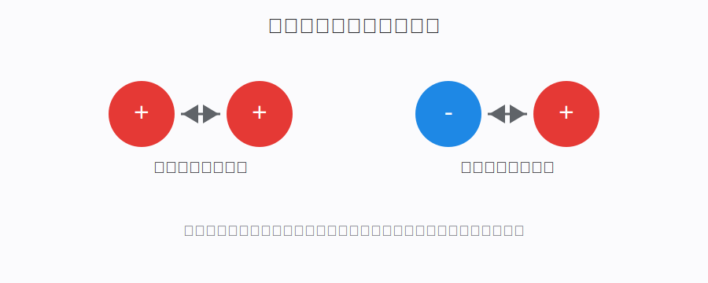
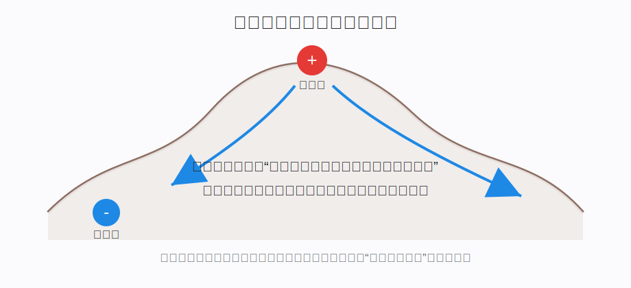
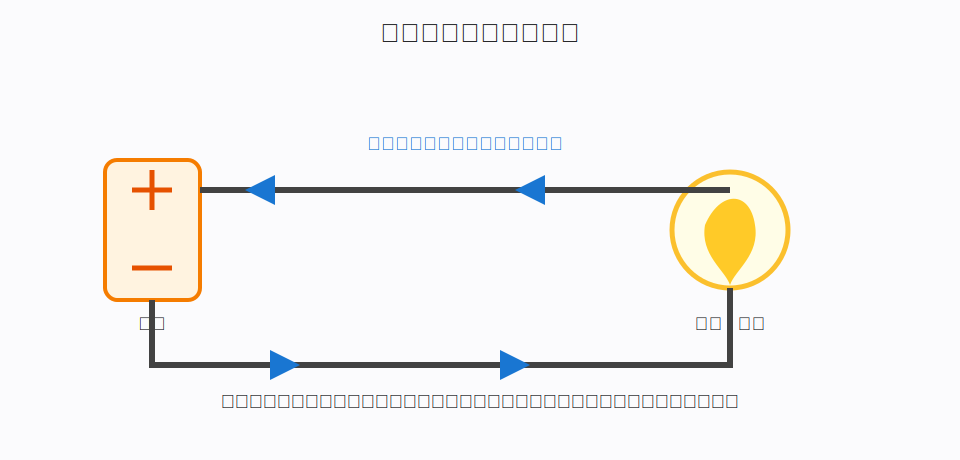
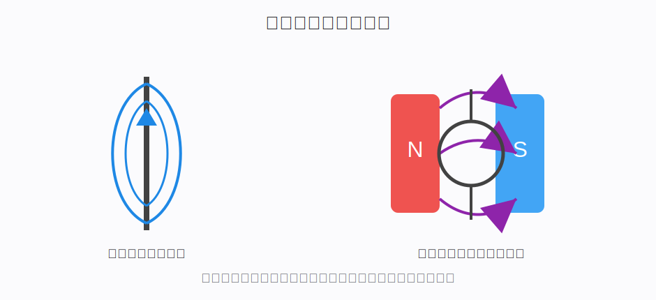

# 理解电必须掌握的物理基础

## 一、为什么学习电之前要先补物理基础

电学中有很多词看起来熟悉，但真正理解并不容易：

- 电荷。
- 电场。
- 电势。
- 电压。
- 电流。
- 电阻。
- 电功率。
- 磁场。
- 电磁感应。

如果直接背公式，会觉得这些概念彼此分散。但从物理逻辑看，它们有清晰的关系：

```text
电荷是根源
  ↓
电荷产生电场
  ↓
电场让电荷受力
  ↓
电势差推动电荷运动
  ↓
电荷定向运动形成电流
  ↓
电流通过电阻会消耗能量
  ↓
电流还能产生磁场
  ↓
变化的磁场又能产生电
```

这篇文章的目标是把这些基础概念串起来。

## 二、电荷：电现象的根源

电荷（Electric Charge）是物质的一种基本属性。

就像质量让物体参与引力作用，电荷让粒子参与电磁相互作用。

电荷有两种：

- 正电荷。
- 负电荷。

基本规律：

```text
同种电荷相互排斥
异种电荷相互吸引
```



### 2.1 电荷从哪里来

普通物质由原子组成。原子内部有：

- 原子核：带正电。
- 电子：带负电。

正常情况下，一个物体中正电荷总量和负电荷总量大致相等，所以整体不显电性。

当电子发生转移时，物体就可能带电：

```text
失去电子 -> 正电荷相对更多 -> 带正电
得到电子 -> 负电荷相对更多 -> 带负电
```

摩擦起电的本质通常就是电子转移。

### 2.2 电荷守恒

电荷不能凭空产生或消失，只能从一个物体转移到另一个物体，或者以正负成对形式出现。

这就是电荷守恒：

> 在一个孤立系统中，电荷总量保持不变。

例如毛皮摩擦橡胶棒：

- 橡胶棒得到电子，带负电。
- 毛皮失去电子，带正电。
- 总电荷仍然守恒。

## 三、电场：电荷如何隔空影响其他电荷

一个带电物体可以在不接触另一个带电物体的情况下产生作用力。为了描述这种“隔空影响”，物理学引入电场。

电场可以理解为：

> 电荷在周围空间建立的一种影响状态。另一个电荷进入这个空间后，会受到电场力。

### 3.1 为什么需要电场这个概念

如果没有电场，我们只能说：

> 电荷 A 隔着一段距离直接拉动或推动电荷 B。

这会让人困惑：力是怎么穿过空间传过去的？

引入电场后，描述变成：

```text
电荷 A 改变周围空间，形成电场
  ↓
电荷 B 位于这个电场中
  ↓
电荷 B 受到电场力
```

这种表达更适合描述复杂电磁现象。

### 3.2 电场方向

物理学规定：

> 电场方向是正电荷在该点受力的方向。

所以：

- 正电荷产生的电场向外发散。
- 负电荷产生的电场向内汇聚。

如果放入一个负电荷，它受力方向会和电场方向相反。

### 3.3 电场强度

电场强度表示电场“有多强”。

公式是：

```text
E = F / q
```

含义是：

- `E`：电场强度。
- `F`：电场对电荷的力。
- `q`：被放入电场中的电荷量。

通俗理解：

> 电场强度表示单位电荷放在这里会受到多大的力。

## 四、电势和电压：为什么电荷会流动

只说电场还不够。要理解电路，必须理解电势和电压。

### 4.1 电势是什么

电势可以粗略类比成“电学中的高度”。

在重力场中：

- 高处的物体有较高的重力势能。
- 物体会倾向于从高处向低处运动。

在电场中：

- 电荷在不同位置有不同电势能。
- 电势描述单位电荷在某处具有多少电势能。



### 4.2 电压是什么

电压（Voltage）是两点之间的电势差。

```text
电压 = 两点之间的电势差
```

如果说电势像高度，那么电压就像高度差。

有高度差，水才倾向于流动；有电势差，电荷才有定向运动的动力。

所以通俗说：

> 电压不是“电流本身”，而是推动电荷运动的原因。

### 4.3 为什么没有电压就没有持续电流

导线中有大量自由电子，但如果没有电势差，它们只是杂乱无章地热运动，不会形成整体方向一致的电流。

电源的作用就是维持两端电势差，让电荷持续受到推动。

```text
没有电压：电子杂乱运动，宏观上没有电流
有电压：电子出现定向漂移，形成电流
```

## 五、电流：电荷的定向运动

电流（Electric Current）表示单位时间内通过某个截面的电荷量。

公式是：

```text
I = Q / t
```

含义是：

- `I`：电流。
- `Q`：通过截面的电荷量。
- `t`：时间。

通俗理解：

> 电流就是电荷流动的“流量”。

### 5.1 电流方向和电子方向为什么相反

物理学早期规定电流方向是正电荷运动方向。

在金属导线中，真正大量移动的是电子，而电子带负电，所以：

```text
约定电流方向：从电源正极到负极
电子漂移方向：从电源负极到正极
```

这不是矛盾，而是历史约定和微观机制不同。

### 5.2 电流需要闭合回路

持续电流需要闭合路径。



一个最简单电路包括：

- 电源：维持电压。
- 导线：提供通路。
- 负载：消耗电能，例如灯泡、电机、电阻。

如果电路断开，电荷无法形成持续定向运动，电流就中断。

## 六、电阻：为什么电流会受到阻碍

电阻（Resistance）表示材料阻碍电流通过的能力。

金属中电子移动时，会受到晶格、杂质、热振动等影响，不能完全自由地运动。

电阻越大，在相同电压下电流越小。

欧姆定律：

```text
U = I · R
```

含义是：

- `U`：电压。
- `I`：电流。
- `R`：电阻。

也可以写成：

```text
I = U / R
```

直觉是：

```text
推动力越大，流动越强
阻碍越大，流动越弱
```

### 6.1 欧姆定律的适用范围

欧姆定律不是所有情况下都严格成立。它适用于很多金属导体在温度稳定、材料性质不剧烈变化时的情况。

例如二极管、晶体管、气体放电、复杂半导体器件就不能简单用固定电阻解释。

## 七、电功率和电能：电如何做功

电功率表示电能转化的快慢。

公式：

```text
P = U · I
```

含义：

- `P`：功率，单位瓦特 W。
- `U`：电压。
- `I`：电流。

如果电压越高、电流越大，单位时间内转化的能量就越多。

电能公式：

```text
W = P · t
```

这就是电费中“度”的来源：

```text
1 度电 = 1 千瓦时 = 1 kW · h
```

### 7.1 为什么电器会发热

电流通过电阻时，电荷和材料内部粒子相互作用，把电能转化为热能。

焦耳热公式：

```text
Q = I^2 · R · t
```

这解释了：

- 电热水壶为什么能加热。
- 电炉丝为什么会发红。
- 电线过载为什么危险。
- 芯片工作时为什么会发热。

## 八、电容：储存电荷和电场能量

电容器由两个导体极板和中间绝缘介质组成。

它的基本功能是储存电荷。

当电容两端接上电压时：

- 一个极板积累正电荷。
- 另一个极板积累负电荷。
- 两极板之间形成电场。

电容的作用包括：

- 平滑电压波动。
- 储能。
- 滤波。
- 隔直流、通交流。
- 构成振荡电路。

通俗理解：

> 电容像一个可以短时间存放电荷的“弹性水箱”。

## 九、电感：电流变化时的惯性

电感通常由线圈构成。

当电流通过线圈时，会产生磁场。电流变化时，磁场也变化，而变化的磁场会反过来产生感应电动势，阻碍电流变化。

所以电感的核心特性是：

> 电感不喜欢电流突然变化。

这类似机械中的惯性：

- 物体不喜欢速度突然变化。
- 电感不喜欢电流突然变化。

电感常用于：

- 滤波。
- 储能。
- 变压器。
- 电机。
- 开关电源。

## 十、磁场：电流和磁之间的关系

磁场不是只和磁铁有关。电流也会产生磁场。



奥斯特实验说明：

> 通电导线周围会产生磁场。

这意味着：

```text
电荷运动
  ↓
形成电流
  ↓
产生磁场
```

### 10.1 电磁铁

如果把导线绕成线圈并通电，线圈产生的磁场会增强。

加入铁芯后，磁场更强。

这就是电磁铁。

电磁铁的优势是：

- 通电有磁性。
- 断电磁性大幅减弱。
- 改变电流大小可以改变磁力大小。
- 改变电流方向可以改变磁极方向。

## 十一、电磁感应：磁如何产生电

法拉第发现：

> 当穿过闭合回路的磁场发生变化时，回路中会产生感应电动势；如果回路闭合，就会产生感应电流。

这就是电磁感应。

发电机的基本逻辑：

```text
外力让线圈在磁场中转动
  ↓
穿过线圈的磁场不断变化
  ↓
线圈中产生感应电动势
  ↓
形成电流
```

所以发电机并不是“凭空创造电能”，而是把机械能转化为电能。

## 十二、直流电和交流电

### 12.1 直流电

直流电（Direct Current，DC）的方向基本不变。

常见来源：

- 电池。
- 充电宝。
- 太阳能电池板。
- 电子电路中的供电。

### 12.2 交流电

交流电（Alternating Current，AC）的大小和方向随时间周期性变化。

家庭插座通常是交流电。

交流电适合大规模电力传输的原因之一是：

- 可以方便地通过变压器升压和降压。
- 高压传输可以减少线路损耗。
- 到用户侧再降压提高安全性。

## 十三、导体、绝缘体和半导体

### 13.1 导体

导体中有容易移动的自由电荷。

常见导体：

- 铜。
- 铝。
- 银。
- 铁。

导体适合传输电流。

### 13.2 绝缘体

绝缘体中的电荷不容易自由移动。

常见绝缘体：

- 橡胶。
- 塑料。
- 陶瓷。
- 干燥空气。

绝缘体用于隔离和保护。

### 13.3 半导体

半导体的导电能力介于导体和绝缘体之间，并且可以通过掺杂、电压、光照、温度等方式控制。

常见半导体材料：

- 硅。
- 锗。
- 砷化镓。

现代电子工业的核心就是半导体。

晶体管能像开关一样控制电流，许多晶体管组合起来就能构成逻辑门、存储器和 CPU。

## 十四、这些概念之间的整体关系

```text
电荷
  ↓ 产生
电场
  ↓ 不同位置形成
电势差 / 电压
  ↓ 推动可移动电荷
电流
  ↓ 经过材料时受到
电阻
  ↓ 转化能量
电功率 / 热 / 光 / 机械能
```

再从电磁角度看：

```text
电流
  ↓ 产生
磁场
  ↓ 变化时
感应电动势
  ↓ 闭合回路中
感应电流
```

这两条线合起来，就是理解电学的基础骨架。

## 十五、核心术语速查表

| 中文术语 | 英文术语 | 含义 |
| --- | --- | --- |
| 电荷 | Electric Charge | 参与电磁相互作用的基本属性 |
| 电荷守恒 | Conservation of Charge | 孤立系统中总电荷不变 |
| 电场 | Electric Field | 电荷周围使其他电荷受力的空间状态 |
| 电场强度 | Electric Field Strength | 单位电荷受到的电场力 |
| 电势 | Electric Potential | 单位电荷在某点具有的电势能 |
| 电压 | Voltage | 两点之间的电势差 |
| 电流 | Electric Current | 电荷的定向运动 |
| 电阻 | Resistance | 阻碍电流通过的性质 |
| 欧姆定律 | Ohm's Law | 电压、电流、电阻之间的关系 |
| 电功率 | Electric Power | 电能转化的快慢 |
| 电容 | Capacitance | 储存电荷和电场能量的能力 |
| 电感 | Inductance | 阻碍电流变化的性质 |
| 磁场 | Magnetic Field | 磁体或电流周围产生的场 |
| 电磁感应 | Electromagnetic Induction | 变化磁场产生电动势的现象 |
| 直流电 | Direct Current, DC | 方向基本不变的电流 |
| 交流电 | Alternating Current, AC | 方向和大小周期性变化的电流 |
| 导体 | Conductor | 容易导电的材料 |
| 绝缘体 | Insulator | 不容易导电的材料 |
| 半导体 | Semiconductor | 导电能力可被控制的材料 |

## 十六、总结

理解电学，最重要的是不要把概念割裂开。

电荷是起点。电荷产生电场，电场带来力和能量分布。电势差推动电荷运动，形成电流。电流通过不同材料时会受到阻碍并发生能量转化。电流还能产生磁场，变化的磁场又能产生电。

所以电学不是一堆公式，而是一条连续的物理逻辑：

```text
电荷 -> 电场 -> 电势差 -> 电流 -> 能量转化 -> 电磁关系
```

掌握这条线后，再学习电路、电子元件、电力系统、通信、计算机硬件和现代电子技术，都会更容易理解。

