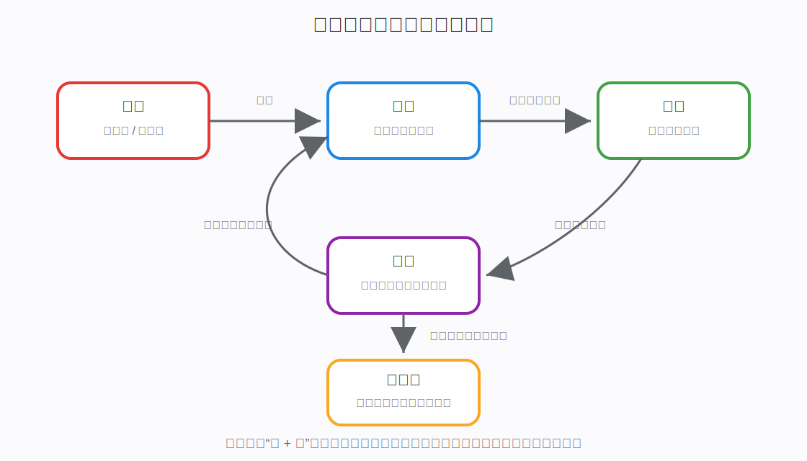
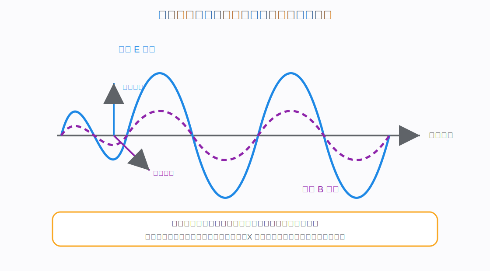
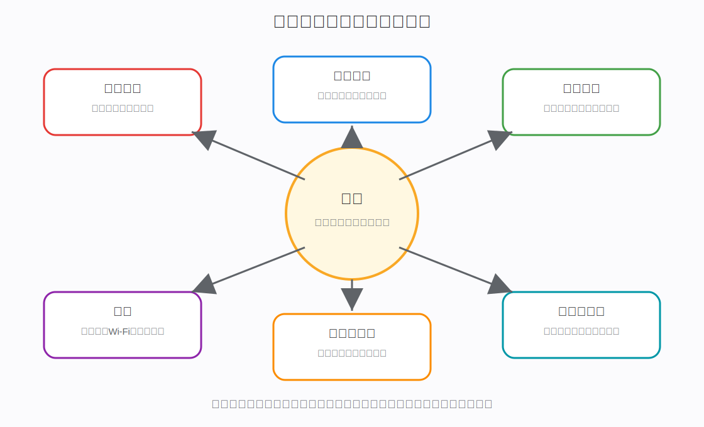

# 电磁：从电场磁场到电磁波

## 一、什么是电磁

电磁（Electromagnetism）是研究电荷、电场、磁场、电流、电磁波以及它们相互关系的物理领域。

通俗地说：

> 电磁讲的是带电粒子如何相互影响，以及这种影响如何表现为电、磁、光、无线通信、电机、发电机和现代电子技术。

在日常语言里，我们经常把“电”和“磁”分开说：

- 电：电池、电流、电压、插座、电路。
- 磁：磁铁、指南针、电磁铁、磁场。

但从现代物理看，电和磁不是完全独立的两件事，而是同一种电磁相互作用在不同条件下的表现。

一句话概括：

> 静止电荷主要表现为电场；运动电荷形成电流并产生磁场；变化的电场和变化的磁场可以相互激发，形成电磁波。



## 二、为什么电和磁最初看起来像两种现象

人类最早认识电和磁时，它们确实表现得很不一样。

### 2.1 电的早期表现

人们发现：

- 摩擦琥珀后，琥珀能吸引轻小物体。
- 冬天脱毛衣会出现静电。
- 闪电是一种强烈放电现象。

这些现象和电荷有关。

### 2.2 磁的早期表现

人们还发现：

- 天然磁石能吸引铁。
- 磁针会指向南北。
- 磁铁有南北极。
- 同名磁极相斥，异名磁极相吸。

这些现象看起来和摩擦起电不同，所以早期人们把电和磁看成两类现象。

### 2.3 电磁统一的关键发现

后来科学家逐步发现：

```text
电流可以产生磁场
变化的磁场可以产生电场
变化的电场也可以产生磁场
光本身是一种电磁波
```

这说明电和磁之间有深层联系。现代物理把它们统一称为电磁现象。

## 三、电磁的核心基础：电荷

电磁现象的根源是电荷。

电荷有两种：

- 正电荷。
- 负电荷。

基本规律：

```text
同种电荷相互排斥
异种电荷相互吸引
```

例如：

- 电子带负电。
- 质子带正电。
- 中子整体不带电。

原子中，带正电的原子核吸引带负电的电子，这使原子能够形成稳定结构。

所以电磁不是只存在于电线和磁铁中。它从原子层面就开始决定物质结构。

## 四、电场：电荷对空间的影响

### 4.1 什么是电场

电场（Electric Field）是电荷在周围空间形成的影响。

如果把另一个电荷放入这个空间，它会受到电场力。

通俗理解：

> 电场告诉一个电荷：如果你在这里，会被往哪个方向推或拉，力有多强。

### 4.2 为什么需要电场

如果没有电场概念，我们只能说：

> 一个电荷隔着空间直接吸引或排斥另一个电荷。

这会让人困惑：力是如何穿过空间传递的？

引入电场后，逻辑变成：

```text
电荷 A 改变周围空间，形成电场
  ↓
电荷 B 位于这个电场中
  ↓
电荷 B 受到力
```

这更适合描述电磁作用的传播和变化。

### 4.3 电场的具体表现

电场可以表现为：

- 静电吸引。
- 静电排斥。
- 电压推动电荷运动。
- 电容器中储存电场能量。
- 原子核吸引电子。
- 化学键形成。

日常物体之间的接触力，本质上也和电磁相互作用有关。你的手摸桌子时，手中原子的电子云和桌子中原子的电子云发生电磁排斥，所以手不会穿过桌子。

## 五、磁场：运动电荷和磁体周围的影响

### 5.1 什么是磁场

磁场（Magnetic Field）是磁体、电流和运动电荷周围产生的一种场。

它会影响：

- 磁针。
- 磁铁。
- 运动电荷。
- 通电导线。
- 电机中的线圈。

### 5.2 电流为什么会产生磁场

电流是电荷的定向运动。

奥斯特实验发现：

> 通电导线会让附近磁针偏转。

这说明：

```text
电荷运动
  ↓
形成电流
  ↓
产生磁场
```

这就是电和磁第一次被实验证明存在直接联系。

### 5.3 磁场的具体表现

磁场可以表现为：

- 磁铁吸引铁。
- 指南针指向南北。
- 电磁铁通电后产生磁性。
- 电机线圈在磁场中受力转动。
- 带电粒子在磁场中发生偏转。
- 地球磁场保护地球免受部分太阳风粒子直接冲击。

## 六、电流、磁场和力：电机为什么能转

通电导线放在磁场中，会受到力。

这背后的核心是：

> 运动电荷在磁场中会受到洛伦兹力。

如果把导线绕成线圈，线圈两侧受到方向不同的力，就会产生转矩，让线圈转动。

电机的基本逻辑：

```text
电流通过线圈
  ↓
线圈在磁场中受力
  ↓
产生转矩
  ↓
线圈持续转动
  ↓
电能转化为机械能
```

所以电机不是“电自己变成了转动”，而是电流和磁场相互作用，对导线产生力，最终形成机械运动。

## 七、电磁感应：磁场变化为什么能产生电

### 7.1 法拉第的关键发现

法拉第发现：

> 当穿过闭合回路的磁场发生变化时，回路中会产生感应电动势；如果回路闭合，就会产生感应电流。

这就是电磁感应。

可以理解为：

```text
磁场变化
  ↓
空间中出现感应电场
  ↓
感应电场推动电荷运动
  ↓
形成感应电流
```

### 7.2 发电机的原理

发电机利用电磁感应。

```text
外部动力让线圈转动
  ↓
线圈中穿过的磁场不断变化
  ↓
产生感应电动势
  ↓
闭合电路中形成电流
  ↓
机械能转化为电能
```

这就是水力发电、风力发电、火力发电、核电中很多发电机的核心原理。

### 7.3 变压器的原理

变压器也依赖电磁感应。

基本过程：

```text
交流电进入原线圈
  ↓
产生变化磁场
  ↓
变化磁场穿过副线圈
  ↓
副线圈产生感应电压
```

通过改变线圈匝数比例，可以升高或降低交流电压。

电网能够高压输电、低压入户，变压器是关键设备之一。

## 八、电磁波：变化的电场和磁场向外传播

麦克斯韦理论指出：

- 变化的磁场可以产生电场。
- 变化的电场可以产生磁场。

如果电场和磁场不断相互激发，并向空间传播，就形成电磁波。



### 8.1 电磁波为什么不需要介质

水波需要水，声波需要空气、液体或固体。

但电磁波不需要普通物质作为传播介质。

它可以在真空中传播。

太阳光能穿过太空到达地球，就是因为光是电磁波。

### 8.2 光也是电磁波

可见光只是电磁波谱中的一小段。

按频率从低到高，大致包括：

```text
无线电波
  ↓
微波
  ↓
红外线
  ↓
可见光
  ↓
紫外线
  ↓
X 射线
  ↓
γ 射线
```

它们本质上都是电磁波，只是频率、波长和单个光子的能量不同。

### 8.3 电磁波携带能量和信息

电磁波可以携带能量：

- 阳光加热地面。
- 微波炉加热食物。
- 激光切割材料。

电磁波也可以携带信息：

- 广播。
- 电视。
- Wi-Fi。
- 蓝牙。
- 手机通信。
- 卫星通信。

信息通常通过调制电磁波的幅度、频率、相位等方式编码进去。

## 九、电磁相互作用在微观世界中的作用

电磁不仅解释电路和电机，也解释物质结构。

### 9.1 原子为什么能形成

原子核带正电，电子带负电。

二者之间存在电磁吸引：

```text
带正电的原子核
  ↓ 吸引
带负电的电子
  ↓
形成原子结构
```

如果没有电磁相互作用，原子无法形成。

### 9.2 分子为什么能形成

分子中的化学键，本质上主要来自电子和原子核之间的电磁相互作用。

原子之间不是靠“微观胶水”粘在一起，而是电子云重新分布，使整个系统能量更低、更稳定。

所以：

> 化学反应本质上是电子结构变化，而电子结构由电磁相互作用主导。

### 9.3 固体为什么能保持形状

固体中的原子和分子按一定结构排列。

当你试图压缩或拉伸固体时，原子之间的距离改变，电子云和原子核之间的电磁相互作用会产生恢复力。

宏观上表现为：

- 硬度。
- 弹性。
- 支撑力。
- 摩擦力。

这些日常接触力，本质上几乎都来自电磁相互作用。

## 十、电磁在自然界中的具体表现

### 10.1 闪电

云层和地面之间、云层内部或云层之间积累大量电荷差。

当电场强到足以击穿空气时，就会发生放电。

```text
电荷积累
  ↓
形成强电场
  ↓
空气被击穿
  ↓
产生巨大电流
  ↓
发光、发热、产生雷声
```

闪电是强烈的电磁现象。

### 10.2 极光

太阳风中的带电粒子进入地球磁场附近，被磁场引导到极区，与高层大气粒子碰撞，使大气发光。

所以极光涉及：

- 太阳带电粒子。
- 地球磁场。
- 大气原子和分子。
- 光的发射。

### 10.3 地球磁场

地球内部导电流体运动会产生地磁场。

地磁场可以：

- 影响指南针。
- 引导带电粒子运动。
- 帮助减弱太阳风对地球大气的直接冲击。

## 十一、电磁在工程技术中的作用



### 11.1 发电和输电

发电机利用电磁感应把机械能转化为电能。

变压器利用电磁感应改变交流电压。

电网利用高压输电降低线路损耗。

这些都建立在电磁规律之上。

### 11.2 电动机

电动机利用电流在磁场中受力，把电能转化为机械能。

应用包括：

- 电风扇。
- 洗衣机。
- 电动车。
- 电梯。
- 工业机器人。
- 无人机。

### 11.3 通信系统

无线通信依赖电磁波。

基本流程：

```text
电路产生变化电信号
  ↓
天线把电信号转化为电磁波
  ↓
电磁波在空间传播
  ↓
接收天线感应出电信号
  ↓
电路解码出信息
```

### 11.4 电子计算

计算机芯片依赖电磁现象。

在数字电路中：

```text
高电平 / 低电平
  ↓
表示 1 / 0
  ↓
晶体管控制电流开关
  ↓
逻辑门组合成加法器、寄存器、CPU
```

所以现代计算机不是抽象符号自己在运行，而是大量电子器件在受控地改变电信号状态。

### 11.5 医疗和检测

电磁也用于医学和检测：

- 心电图：测量心脏电活动。
- 脑电图：测量大脑电活动。
- MRI：利用强磁场和射频电磁波获取人体内部信息。
- X 射线成像：利用高频电磁波穿透人体组织。

## 十二、电磁和能量的关系

电磁场可以携带能量。

例如：

- 电容器中储存电场能量。
- 电感和磁体周围存在磁场能量。
- 电磁波携带能量向外传播。

电路中能量传输也不只是“电子把能量从电源搬到灯泡”这么简单。更准确地说，电磁场在电路周围建立起来，并把能量传递到负载。

灯泡发光时：

```text
电源建立电场
  ↓
电场推动电荷运动
  ↓
电磁场把能量传递到灯丝或 LED
  ↓
负载把电能转化为光和热
```

## 十三、电磁和力的关系

电磁相互作用是自然界四种基本相互作用之一。

它能产生很多宏观力：

- 静电力。
- 磁力。
- 接触力。
- 弹力。
- 摩擦力。
- 分子间作用力。
- 化学键作用。

其中接触力、弹力、摩擦力在宏观上看起来不是“电力”，但微观本质大多来自原子和电子之间的电磁相互作用。

这说明：

> 电磁作用不只是电线里的现象，它是日常物质结构和宏观力的基础之一。

## 十四、用麦克斯韦方程理解电磁主线

麦克斯韦方程是经典电磁学的核心。

这里不展开复杂数学，只讲物理含义。

### 14.1 电荷产生电场

电荷是电场的来源。

```text
正电荷周围电场向外
负电荷周围电场向内
```

### 14.2 没有单独的磁荷

目前没有发现单独存在的磁单极子。

磁铁总是表现为南北两极成对出现。

把磁铁切成两半，不会得到单独的南极和北极，而会得到两个更小的磁铁。

### 14.3 变化磁场产生电场

这对应电磁感应。

发电机、变压器、电磁炉都依赖它。

### 14.4 电流和变化电场产生磁场

通电导线产生磁场。

变化电场也能产生磁场，这一点对电磁波存在非常关键。

这四条思想合起来，就能解释：

```text
电荷
  ↓
电场
  ↓
电流
  ↓
磁场
  ↓
电磁感应
  ↓
电磁波
```

## 十五、常见误区

### 15.1 误区一：电和磁是完全不同的东西

日常现象中它们看起来不同，但现代物理把它们统一为电磁相互作用。

静止电荷主要表现为电场，运动电荷会产生磁效应。

### 15.2 误区二：磁场只来自磁铁

磁场不仅来自磁铁，也来自电流和运动电荷。

电磁铁、电机、变压器都说明电流可以产生磁场。

### 15.3 误区三：电磁波必须靠空气传播

电磁波可以在真空中传播。

太阳光穿过太空到达地球，就是最直接的例子。

### 15.4 误区四：光和电没有关系

光是电磁波。

可见光只是人眼能感知的一小段电磁波。

### 15.5 误区五：电路能量就是电子从电源搬过去的

电子确实会发生漂移，但电路中的能量传递更准确地由电磁场描述。

电信号传播速度远大于单个电子的漂移速度。

## 十六、学习电磁应该抓住的主线

学习电磁时，建议始终抓住下面这条线：

```text
电荷
  ↓
电场
  ↓
电势差
  ↓
电流
  ↓
磁场
  ↓
电磁感应
  ↓
电磁波
  ↓
电力、通信、计算、医疗和自然现象
```

再进一步理解：

```text
微观上：电磁作用决定原子、分子和材料性质
宏观上：电磁作用表现为电路、电机、发电、通信和光
工程上：电磁规律支撑现代电力系统、电子设备和信息社会
```

## 十七、核心术语速查表

| 中文术语 | 英文术语 | 通俗含义 |
| --- | --- | --- |
| 电磁 | Electromagnetism | 电荷、电场、磁场、电流和电磁波相关的一整类现象 |
| 电荷 | Electric Charge | 电磁相互作用的根源属性 |
| 电场 | Electric Field | 电荷周围使其他电荷受力的场 |
| 磁场 | Magnetic Field | 电流、磁体或运动电荷周围产生的场 |
| 电流 | Electric Current | 电荷的定向运动 |
| 电磁感应 | Electromagnetic Induction | 变化磁场产生感应电动势或电流的现象 |
| 洛伦兹力 | Lorentz Force | 带电粒子在电场和磁场中受到的力 |
| 电磁波 | Electromagnetic Wave | 变化电场和变化磁场相互激发并传播的波 |
| 光子 | Photon | 电磁波的量子，携带能量和动量 |
| 麦克斯韦方程 | Maxwell's Equations | 经典电磁学的核心方程组 |
| 电磁相互作用 | Electromagnetic Interaction | 自然界四种基本相互作用之一，作用于带电粒子 |
| 变压器 | Transformer | 利用电磁感应改变交流电压的设备 |
| 发电机 | Generator | 利用电磁感应把机械能转化为电能的设备 |
| 电动机 | Motor | 利用电流在磁场中受力，把电能转化为机械能的设备 |

## 十八、总结

电磁是理解现代物理和现代技术的关键概念。

从本质上看：

> 电磁是由电荷及其运动引发的场和相互作用。电荷产生电场，电荷运动形成电流并产生磁场，变化的电场和变化的磁场可以相互激发形成电磁波。

从作用上看：

> 电磁相互作用决定了原子、分子、化学键、材料性质和许多宏观接触力。

从应用上看：

> 发电机、电动机、变压器、电网、无线通信、计算机芯片、医学成像、传感器和光学技术都建立在电磁规律之上。

所以电磁不是某个单独知识点，而是一条贯穿微观粒子、物质结构、自然现象和现代工程技术的基础主线。

