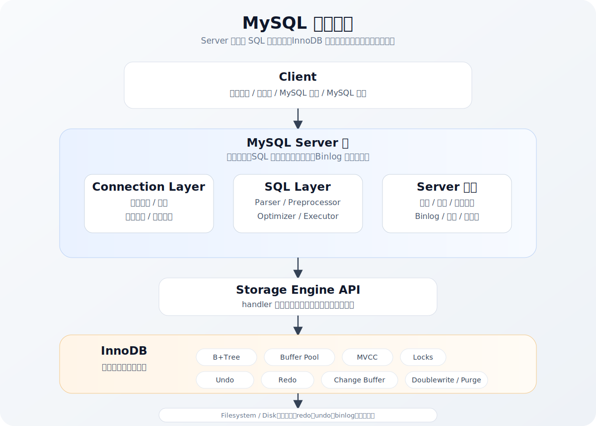
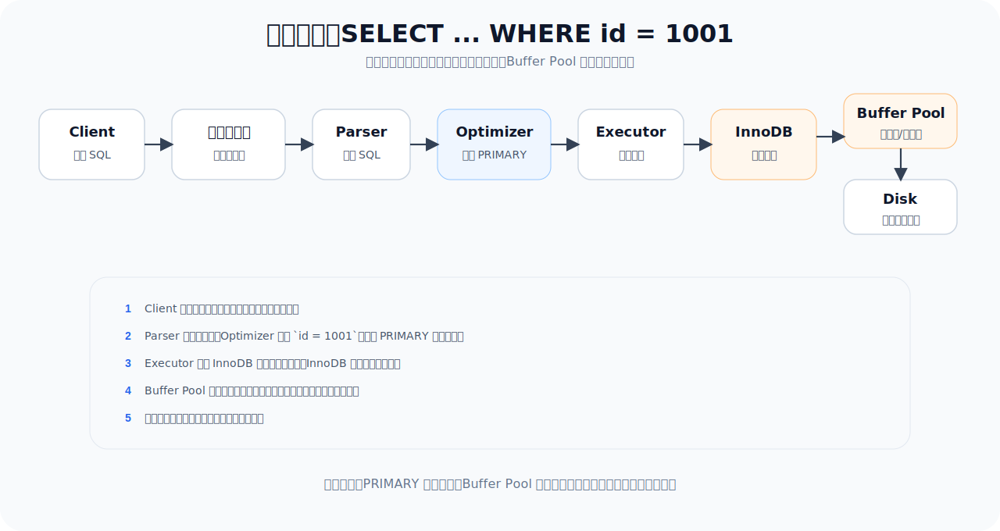
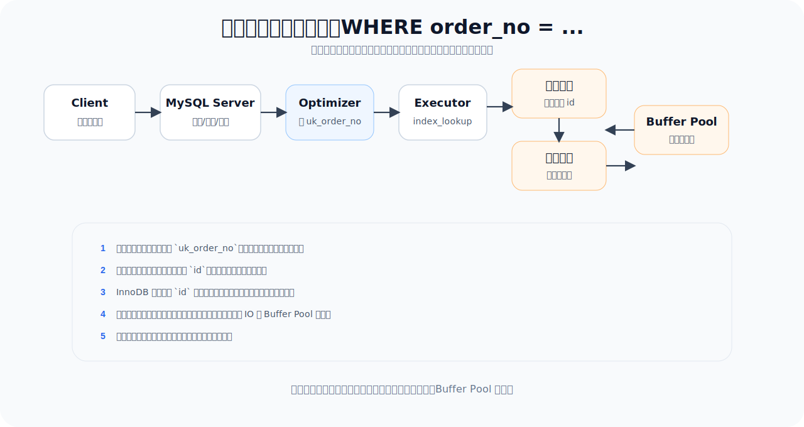
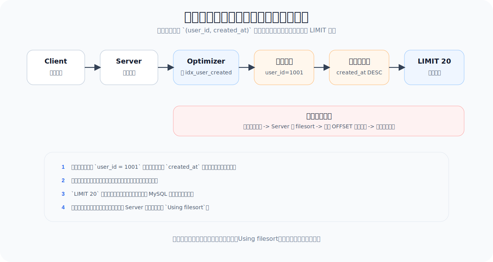
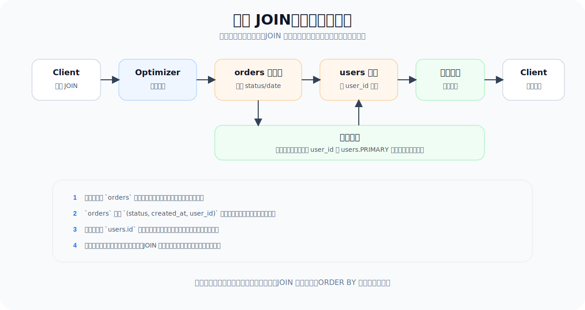
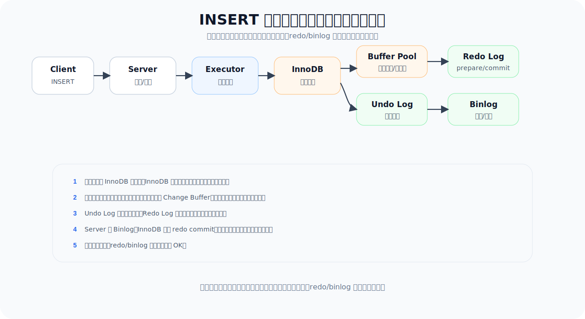
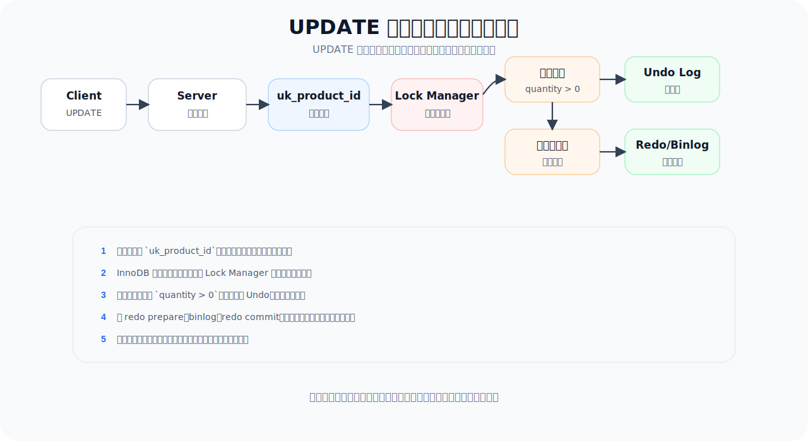
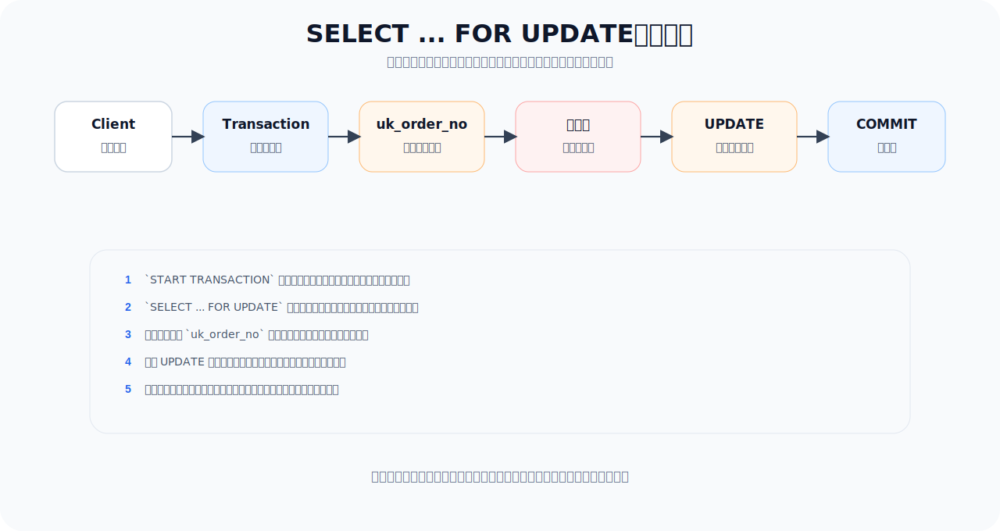
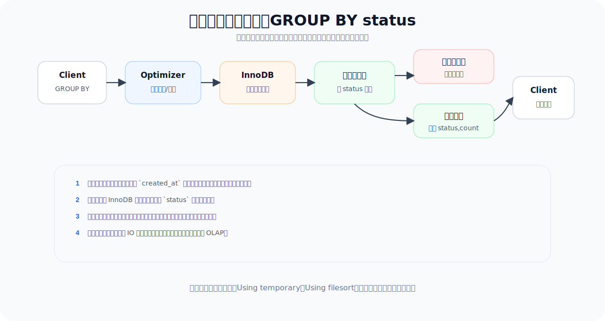

# MySQL 架构

## 一、为什么要学习 MySQL 架构

很多 MySQL 问题表面上是 SQL 慢、锁等待、主从延迟、连接打满、磁盘 IO 高，真正原因往往藏在架构链路里。

例如：

```sql
SELECT * FROM orders WHERE order_no = 'A202607220001';
```

这条 SQL 看起来很简单，但它从客户端到 MySQL 服务端至少会经过：

1. 网络连接与认证；
2. SQL 解析；
3. 权限检查；
4. 优化器生成执行计划；
5. 执行器调用存储引擎；
6. InnoDB 通过索引定位记录；
7. Buffer Pool 命中或磁盘读取；
8. 返回结果给客户端。

从高性能 MySQL 的角度看，学习架构不是为了背模块名称，而是为了回答这些生产问题：

- 为什么同一条 SQL 有时很快，有时很慢；
- 为什么索引不合理会扩大锁范围；
- 为什么长事务会拖垮 Undo Log 和 MVCC；
- 为什么写入提交既涉及 redo log，又涉及 binlog；
- 为什么连接数、线程数、临时表、排序、Buffer Pool 都会影响吞吐量；
- 为什么读写分离会出现写后读不一致。

可以先把 MySQL 理解成三层：

```text
客户端层
  应用程序、连接池、MySQL 协议、驱动

MySQL Server 层
  连接管理、认证授权、SQL 解析、优化器、执行器、Binlog、复制、函数、视图、存储过程

存储引擎层
  InnoDB、MyISAM、MEMORY 等，负责数据页、索引、事务、锁、崩溃恢复
```

现在绝大多数生产系统使用 InnoDB，所以本文重点以 **MySQL Server 层 + InnoDB** 为主线。

## 二、MySQL 整体架构图



需要注意：**MySQL Server 层负责“怎么执行 SQL”，InnoDB 负责“怎么存取数据”。**

优化 SQL 时，两层都要看：

- Server 层：SQL 写法、执行计划、排序、临时表、函数计算、连接数、线程调度；
- InnoDB 层：索引组织、Buffer Pool、锁、MVCC、redo log、undo log、刷盘策略。

## 三、客户端与连接管理模块

### 1. 客户端与 MySQL 协议

客户端可以是 Java、Go、Python、PHP 应用，也可以是命令行工具：

```bash
mysql -h 127.0.0.1 -P 3306 -u root -p
```

它们通过 MySQL 协议和服务端通信。一次查询不是简单地“发 SQL 字符串”，还包括连接建立、认证、命令包发送、结果集返回、错误码返回等过程。

高性能影响：

- 网络延迟会直接增加 SQL 响应时间；
- 大结果集会消耗网络、内存和客户端解析成本；
- 频繁创建连接会造成认证、线程创建、握手开销；
- 应用连接池配置不当，会造成数据库连接打满或应用侧排队。

实战建议：

- 应用侧使用连接池，不要每次请求都新建数据库连接；
- 控制连接池最大连接数，不要让多个应用实例把 MySQL 打满；
- 查询只返回必要字段，避免 `SELECT *` 和大结果集；
- 对后台导出、报表查询做限流和异步化。

### 2. 连接管理器

MySQL 服务端收到连接后，会为连接分配线程或从线程缓存中复用线程。每个连接都有自己的会话状态，例如：

- 当前数据库；
- 字符集；
- 事务状态；
- 隔离级别；
- 用户变量；
- 临时表；
- 预处理语句。

常见相关参数：

```sql
SHOW VARIABLES LIKE 'max_connections';
SHOW VARIABLES LIKE 'thread_cache_size';
SHOW STATUS LIKE 'Threads%';
SHOW STATUS LIKE 'Connections';
```

高性能影响：

- `max_connections` 太小会导致应用无法连接；
- `max_connections` 太大也不是好事，过多并发线程会引发上下文切换、内存消耗和锁竞争；
- 慢 SQL 堆积时，连接会长时间占用线程，进一步拖慢系统；
- 应用连接池过大，可能把数据库变成排队场，而不是提升吞吐量。

实战建议：

- 优先优化慢 SQL 和事务时间，而不是盲目调大连接数；
- 应用连接池总量要和 MySQL 实际承载能力匹配；
- 监控 `Threads_running`，它比单纯的连接总数更能反映当前压力；
- 连接数暴涨时，要排查慢 SQL、锁等待、应用重试风暴和连接泄漏。

### 3. 认证与权限模块

认证模块负责确认用户身份，权限模块负责判断用户是否能访问某个库、表、列或执行某类操作。

例如：

```sql
SELECT * FROM orders;
```

MySQL 需要判断当前用户是否有 `orders` 表的 `SELECT` 权限。

高性能影响：

- 权限检查通常不是性能瓶颈，但权限模型复杂会增加运维成本；
- 生产应用账号权限过大，会放大误操作和 SQL 注入风险；
- 过多账号、主机匹配和授权混乱，会增加治理难度。

实战建议：

- 应用账号遵循最小权限原则；
- 读写账号分离；
- 禁止普通应用账号拥有 `DROP`、`TRUNCATE`、高危 DDL 权限；
- 生产变更使用受控账号和审计流程。

## 四、SQL 层核心模块

### 1. 解析器 Parser

解析器负责把 SQL 文本转换成 MySQL 能理解的语法树。

例如：

```sql
SELECT id, amount
FROM orders
WHERE user_id = 1001
ORDER BY created_at DESC
LIMIT 20;
```

解析器会识别：

- 这是 `SELECT` 语句；
- 查询字段是 `id`、`amount`；
- 目标表是 `orders`；
- 过滤条件是 `user_id = 1001`；
- 排序字段是 `created_at DESC`；
- 限制返回 20 行。

如果 SQL 语法错误，会在解析阶段直接失败。

高性能影响：

- 普通业务中解析开销通常不是主要瓶颈；
- 高频短 SQL 场景下，预处理语句可以减少重复解析和网络传输成本；
- SQL 写得越复杂，后续优化器搜索空间可能越大。

### 2. 预处理器 Preprocessor

预处理器负责语义检查，例如：

- 表是否存在；
- 字段是否存在；
- 字段是否歧义；
- 函数和表达式是否合法；
- 视图是否可以展开。

例如：

```sql
SELECT unknown_column FROM orders;
```

如果 `unknown_column` 不存在，会在这个阶段报错。

### 3. 优化器 Optimizer

优化器是 MySQL 性能中最关键的 Server 层模块之一。它负责决定“怎么执行更划算”。

同一条 SQL 可能有多种执行方式：

```sql
SELECT *
FROM orders
WHERE user_id = 1001
  AND status = 'paid'
ORDER BY created_at DESC
LIMIT 20;
```

优化器需要决定：

- 走哪个索引；
- 是否全表扫描；
- 是否使用索引排序；
- 是否需要临时表；
- 是否需要文件排序；
- 多表 JOIN 时谁做驱动表；
- 是否能做条件下推、索引下推、派生表合并等优化。

优化器主要基于成本估算，而成本依赖统计信息、索引选择性、行数估计、数据分布等。

高性能影响：

- 统计信息不准可能导致选错索引；
- 联合索引顺序会影响优化器可选择的路径；
- `ORDER BY`、`GROUP BY`、`DISTINCT` 可能引入临时表和排序；
- 多表 JOIN 顺序错误会造成扫描行数暴涨；
- 隐式类型转换、函数包裹索引列会让优化器难以使用索引。

常用观察工具：

```sql
EXPLAIN SELECT ...;
EXPLAIN ANALYZE SELECT ...;
SHOW WARNINGS;
ANALYZE TABLE orders;
```

实战建议：

- 所有核心 SQL 上线前都应看 `EXPLAIN`；
- 关注 `type`、`key`、`rows`、`filtered`、`Extra`；
- 大表出现 `ALL`、大量 `Using filesort`、大量 `Using temporary` 时要重点评估；
- 不要迷信“有索引就一定快”，要看扫描行数和回表成本。

### 4. 执行器 Executor

执行器负责按照优化器选出的执行计划真正执行 SQL。

它会：

- 调用存储引擎接口读取或修改数据；
- 对返回记录做过滤；
- 执行表达式计算；
- 执行排序、分组、聚合；
- 处理 LIMIT；
- 把结果集返回客户端。

高性能影响：

- 执行器处理的行数越多，CPU、内存、网络消耗越大；
- 存储引擎返回大量行后再过滤，会浪费 IO 和 CPU；
- 排序和分组数据量过大，可能使用磁盘临时表；
- 返回字段越多，回表、内存和网络成本越高。

实战建议：

- 让过滤尽量发生在索引和存储引擎层；
- 避免 `SELECT *`；
- 大分页用游标分页或延迟关联；
- 大统计任务不要和在线交易混跑，必要时放到只读库或 OLAP 系统。

## 五、存储引擎接口层

MySQL 使用插件式存储引擎。Server 层不直接操作数据文件，而是通过统一的 handler 接口调用存储引擎。

例如执行器可能向引擎发出这些请求：

- 打开表；
- 通过主键读取一行；
- 通过索引范围扫描；
- 插入一行；
- 更新一行；
- 删除一行；
- 提交事务；
- 回滚事务。

这样 MySQL 可以支持不同存储引擎：

- InnoDB：事务、行锁、MVCC、崩溃恢复，生产默认选择；
- MyISAM：表锁、不支持事务，核心业务不推荐；
- MEMORY：内存表，数据重启丢失；
- ARCHIVE：归档场景；
- CSV：文件交换或测试场景。

从高性能 MySQL 的角度看，存储引擎接口带来的关键认知是：**Server 层决定访问路径，存储引擎决定路径上的真实代价。**

例如优化器决定使用 `idx_user_created`，但真正的索引页读取、Buffer Pool 命中、行锁、回表，都发生在 InnoDB。

## 六、InnoDB 核心模块

### 1. 表空间与数据页

InnoDB 以页为基本单位管理数据，默认页大小通常是 16KB。

表和索引最终都会落在表空间中：

- 系统表空间；
- 独立表空间；
- undo 表空间；
- 临时表空间；
- redo log 文件。

高性能影响：

- MySQL 不是一行一行从磁盘读，而是一页一页读；
- 一次查询命中的数据页越少，IO 成本越低；
- 行越大，一个页能放的记录越少，缓存效率越差；
- 大字段、宽表会降低 Buffer Pool 的有效利用率。

实战建议：

- 字段类型尽量精确，不要无脑使用大字段；
- 热点字段和大字段可以考虑拆表；
- 高频查询尽量只读取必要字段；
- 表结构设计要考虑缓存命中率，而不只是字段能不能放下。

### 2. B+Tree 索引模块

InnoDB 使用 B+Tree 组织索引。

主键索引是聚簇索引，叶子节点保存完整行数据。二级索引叶子节点保存索引列和主键值。

例如：

```sql
CREATE TABLE orders (
  id BIGINT UNSIGNED PRIMARY KEY AUTO_INCREMENT,
  order_no VARCHAR(64) NOT NULL,
  user_id BIGINT UNSIGNED NOT NULL,
  status TINYINT NOT NULL,
  amount DECIMAL(10, 2) NOT NULL,
  created_at DATETIME NOT NULL,
  UNIQUE KEY uk_order_no(order_no),
  KEY idx_user_created(user_id, created_at)
) ENGINE=InnoDB;
```

查询订单号：

```sql
SELECT * FROM orders WHERE order_no = 'A202607220001';
```

执行路径通常是：

1. 通过唯一索引 `uk_order_no` 找到主键 `id`；
2. 根据 `id` 回到聚簇索引读取完整行；
3. 返回数据。

如果查询字段被二级索引覆盖：

```sql
SELECT id FROM orders WHERE order_no = 'A202607220001';
```

二级索引中已经有 `order_no` 和主键 `id`，通常不需要回表。

高性能影响：

- 主键越短，所有二级索引越小；
- 主键越随机，页分裂和写放大越明显；
- 回表次数越多，随机 IO 和 Buffer Pool 压力越大；
- 联合索引可以同时优化过滤、排序和覆盖查询。

### 3. Buffer Pool

Buffer Pool 是 InnoDB 最重要的内存模块，用于缓存数据页和索引页。

查询时：

- 如果目标页在 Buffer Pool 中，直接内存读取；
- 如果不在 Buffer Pool 中，需要从磁盘读取页到内存。

更新时：

- 通常先修改 Buffer Pool 中的数据页；
- 被修改但未刷盘的页叫脏页；
- 后台线程会在合适时机把脏页刷回磁盘。

高性能影响：

- Buffer Pool 命中率高，查询主要走内存；
- Buffer Pool 太小，会频繁淘汰页并触发磁盘 IO；
- 大查询可能污染 Buffer Pool，把热点页挤出去；
- 大量脏页刷盘可能造成 IO 抖动。

常用观察：

```sql
SHOW VARIABLES LIKE 'innodb_buffer_pool_size';
SHOW GLOBAL STATUS LIKE 'Innodb_buffer_pool%';
SHOW ENGINE INNODB STATUS\G
```

实战建议：

- 专用数据库服务器通常把 Buffer Pool 设置为物理内存的 60% 到 75%，具体要给系统、连接、日志、临时表留空间；
- 避免在线库执行无节制全表扫描；
- 大报表、大导出尽量走只读库或离线系统；
- 表和索引设计要减少不必要的数据页访问。

### 4. MVCC 与 Read View

MVCC 是多版本并发控制。它让普通快照读在很多情况下不阻塞写，写也不阻塞普通读。

InnoDB 每行记录有隐藏字段，配合 Undo Log 保存历史版本。事务读取时，通过 Read View 判断哪个版本对当前事务可见。

普通快照读：

```sql
SELECT * FROM orders WHERE id = 1;
```

当前读：

```sql
SELECT * FROM orders WHERE id = 1 FOR UPDATE;
UPDATE orders SET status = 2 WHERE id = 1;
DELETE FROM orders WHERE id = 1;
```

高性能影响：

- MVCC 提升读写并发能力；
- 长事务会导致旧版本长期无法清理，Undo Log 膨胀；
- 快照读不等于读最新数据；
- 当前读会加锁，可能产生锁等待。

实战建议：

- 事务要短；
- 不要在事务里做 HTTP、RPC、文件处理等慢操作；
- 库存、余额、订单状态流转要用当前读或原子更新；
- 对“写后马上读”的业务，要明确读主库还是从库，读快照还是读最新。

### 5. 锁模块

InnoDB 常见锁包括：

- 行锁；
- 间隙锁；
- Next-Key Lock；
- 表级意向锁；
- 自增锁；
- 元数据锁由 Server 层管理，但经常和 InnoDB 事务一起影响线上行为。

高性能影响：

- 行锁依赖索引，索引不合理会扩大锁范围；
- 范围当前读可能引入间隙锁；
- 长事务持锁时间长，会造成锁等待堆积；
- DDL 可能等待元数据锁，被长事务阻塞；
- 死锁通常来自访问顺序不一致、索引缺失、事务范围过大。

排查工具：

```sql
SHOW ENGINE INNODB STATUS\G

SELECT *
FROM information_schema.innodb_trx;
```

MySQL 8.0 也可以结合 `performance_schema.data_locks`、`data_lock_waits` 观察锁。

实战建议：

- 更新和删除必须命中合适索引；
- 用唯一索引定位单行，锁范围最小；
- 批量更新分批提交；
- 多个业务流程更新多张表时，尽量统一加锁顺序；
- 避免大事务和交互式事务。

### 6. Undo Log

Undo Log 主要承担两个角色：

- 事务回滚：记录修改前的值；
- MVCC：提供历史版本。

例如：

```sql
UPDATE account SET balance = balance - 100 WHERE id = 1;
```

InnoDB 会在 Undo Log 中记录旧版本，用于回滚或快照读。

高性能影响：

- 大事务会产生大量 Undo Log；
- 长事务会阻止 Undo Log 被 purge 清理；
- Undo 版本链过长会拖慢快照读；
- 大量历史版本会增加存储和恢复压力。

实战建议：

- 避免一次更新海量数据；
- 批处理任务按主键范围分批提交；
- 监控长事务；
- 业务事务边界只包住真正需要一致性的 SQL。

### 7. Redo Log

Redo Log 是 InnoDB 的物理日志，用于崩溃恢复，也提升写入性能。

如果每次提交都把随机数据页刷盘，性能会很差。InnoDB 使用 redo log 把随机写变成更高效的顺序写。

简化流程：

1. 修改 Buffer Pool 中的数据页；
2. 写入 redo log buffer；
3. 提交时按策略刷 redo log；
4. 后台线程把脏页刷回磁盘；
5. 宕机后通过 redo log 恢复已提交修改。

关键参数：

```sql
SHOW VARIABLES LIKE 'innodb_flush_log_at_trx_commit';
```

常见取值：

- `1`：每次事务提交都刷盘，可靠性最高；
- `2`：每次提交写入 OS Cache，每秒刷盘；
- `0`：每秒写入并刷盘，性能更激进，可靠性更弱。

高性能影响：

- redo log 写入能力影响事务提交吞吐；
- redo log 空间太小会导致频繁 checkpoint；
- 刷盘策略影响性能和数据丢失风险；
- IO 抖动会拉高提交延迟。

实战建议：

- 订单、支付、账户等核心业务优先可靠性；
- 可重放日志、埋点等场景可按业务容忍度权衡；
- 监控磁盘延迟，而不是只看 SQL 层耗时；
- 不要把 redo log、binlog、数据文件的 IO 压力完全忽视。

### 8. Change Buffer

Change Buffer 用于优化非唯一二级索引的写入。当要修改的二级索引页不在 Buffer Pool 中时，InnoDB 可以先把变更记录到 Change Buffer，后续读取或后台合并时再应用到真实索引页。

高性能影响：

- 对写多读少的非唯一二级索引有帮助；
- 对唯一索引帮助有限，因为唯一性检查通常必须读取索引页；
- 如果写入后很快读取同一索引范围，合并成本仍然会出现；
- 索引过多时，写入维护成本仍然会上升。

实战建议：

- 不要为了“可能会查”给所有字段建索引；
- 唯一索引表达真实业务约束，不要滥用；
- 写密集表要控制二级索引数量。

### 9. Doublewrite Buffer

Doublewrite Buffer 用于降低数据页部分写失败带来的损坏风险。

磁盘写入一个 16KB 页时，如果只写了一半就宕机，数据页可能损坏。InnoDB 会先把页写到 doublewrite 区域，再写到最终位置。恢复时如果发现页损坏，可以用 doublewrite 中的完整副本恢复。

高性能影响：

- 提升可靠性；
- 带来额外写入成本；
- 在高写入负载下会影响 IO；
- 现代存储和 MySQL 版本对该机制有不同优化。

核心业务通常不应为了追求极限写入而轻易牺牲可靠性。

## 七、日志与复制模块

### 1. Binlog

Binlog 是 MySQL Server 层日志，记录逻辑变更，用于：

- 主从复制；
- 时间点恢复；
- 数据审计；
- 数据订阅。

常见格式：

- Statement：记录 SQL；
- Row：记录行变更；
- Mixed：混合模式。

生产中通常优先使用 Row 格式，因为复制更确定，虽然日志量可能更大。

查看配置：

```sql
SHOW VARIABLES LIKE 'log_bin';
SHOW VARIABLES LIKE 'binlog_format';
SHOW VARIABLES LIKE 'sync_binlog';
```

高性能影响：

- binlog 刷盘策略影响提交性能和故障丢失风险；
- 大事务会生成大 binlog，导致复制延迟；
- Row 格式更可靠，但日志量更大；
- binlog 保留过久会占用大量磁盘。

### 2. Redo Log 与 Binlog 两阶段提交

InnoDB 的 redo log 和 MySQL Server 的 binlog 分属两层。事务提交时，需要保证两者一致，否则可能出现：

- InnoDB 已提交，但 binlog 没记录，复制和恢复丢数据；
- binlog 已记录，但 InnoDB 没提交，恢复后数据不一致。

因此 MySQL 使用两阶段提交协调 redo log 和 binlog：

```text
1. InnoDB 写 redo log prepare
2. Server 写 binlog
3. InnoDB 写 redo log commit
```

高性能影响：

- 提交事务要同时考虑 redo 和 binlog；
- `innodb_flush_log_at_trx_commit` 和 `sync_binlog` 共同影响可靠性与性能；
- 开启 binlog 后写入成本会增加，但换来复制和恢复能力。

### 3. 主从复制

复制的大致流程：

1. 主库提交事务，写入 binlog；
2. 从库 IO 线程拉取主库 binlog；
3. 从库写入 relay log；
4. 从库 SQL 线程或多线程复制回放 relay log；
5. 从库数据追上主库。

高性能影响：

- 主库大事务会导致从库回放慢；
- 从库执行慢 SQL 会导致延迟；
- 热点表、无主键表、DDL 都可能放大复制延迟；
- 读写分离下，从库延迟会导致读到旧数据。

实战建议：

- 强一致读、写后读走主库或使用一致性路由；
- 控制大事务和批量更新；
- 从库也要有合理索引，因为复制回放也要执行更新；
- 监控 `Seconds_Behind_Master` 或基于 GTID/心跳的延迟指标。

## 八、临时表、排序与聚合模块

很多慢 SQL 不是因为没有连接或认证问题，而是因为执行阶段产生了大量临时数据。

常见触发场景：

```sql
SELECT status, COUNT(*)
FROM orders
WHERE created_at >= '2026-07-01'
GROUP BY status;
```

```sql
SELECT *
FROM orders
WHERE user_id = 1001
ORDER BY amount DESC
LIMIT 20;
```

如果索引不能同时满足过滤、分组、排序，MySQL 可能使用：

- 内存临时表；
- 磁盘临时表；
- filesort；
- 聚合计算。

高性能影响：

- 数据量小时问题不明显；
- 数据量大时会消耗 CPU、内存、磁盘临时空间；
- 磁盘临时表会明显拉高延迟；
- 报表 SQL 可能挤占在线交易资源。

观察指标：

```sql
SHOW GLOBAL STATUS LIKE 'Created_tmp%';
SHOW GLOBAL STATUS LIKE 'Sort%';
```

实战建议：

- 高频列表页用联合索引同时服务 `WHERE` 和 `ORDER BY`；
- 高频统计可以用汇总表、异步计算、缓存或 OLAP；
- 后台导出分批分页，不要一次拉全量；
- 对复杂报表隔离到只读库或分析系统。

## 九、不同查询的执行时序图

下面用时序图描述不同 SQL 从客户端到 MySQL 服务端的典型链路。实际 MySQL 内部更复杂，但这些图能帮助建立性能分析的主线。

### 1. 主键点查

SQL：

```sql
SELECT id, order_no, amount
FROM orders
WHERE id = 1001;
```

特点：

- 主键等值查询；
- 优化器通常选择 `const`；
- InnoDB 通过聚簇索引定位一行；
- 性能通常最稳定。



性能分析重点：

- 是否使用主键或唯一索引；
- Buffer Pool 是否命中；
- 返回字段是否过多；
- 单次很快但并发很高时，关注连接池、CPU 和热点页竞争。

### 2. 二级索引查询并回表

SQL：

```sql
SELECT id, order_no, amount, status
FROM orders
WHERE order_no = 'A202607220001';
```

假设 `order_no` 是唯一二级索引。



性能分析重点：

- 二级索引是否唯一，能否快速定位；
- 是否发生回表；
- 如果只查 `id`，是否可以覆盖索引；
- 回表次数多时，延迟会明显上升。

### 3. 范围查询、排序与分页

SQL：

```sql
SELECT id, order_no, amount, created_at
FROM orders
WHERE user_id = 1001
ORDER BY created_at DESC
LIMIT 20;
```

理想索引：

```sql
CREATE INDEX idx_user_created ON orders(user_id, created_at);
```



如果没有合适索引，可能变成：

```text
扫描大量订单 -> Server 层排序 -> 取前 20 行
```

性能分析重点：

- 索引是否同时满足过滤和排序；
- `LIMIT` 是否能提前停止扫描；
- 是否出现 `Using filesort`；
- 深分页 `LIMIT 20 OFFSET 100000` 是否导致扫描大量无用行；
- 返回字段是否导致大量回表。

### 4. 多表 JOIN 查询

SQL：

```sql
SELECT o.id, o.order_no, u.name
FROM orders o
JOIN users u ON o.user_id = u.id
WHERE o.status = 2
  AND o.created_at >= '2026-07-01'
ORDER BY o.created_at DESC
LIMIT 100;
```

可能索引：

```sql
CREATE INDEX idx_status_created_user ON orders(status, created_at, user_id);
-- users.id 通常是主键
```



性能分析重点：

- 驱动表是否足够小；
- 被驱动表关联字段是否有索引；
- JOIN 字段类型是否一致；
- 是否先过滤再 JOIN；
- 是否产生大中间结果集；
- `ORDER BY` 是否能利用驱动表索引。

JOIN 优化的核心不是“少 JOIN”，而是让每一步访问的数据量可控。

### 5. INSERT 写入

SQL：

```sql
INSERT INTO orders(order_no, user_id, status, amount, created_at)
VALUES('A202607220001', 1001, 1, 99.00, NOW());
```



性能分析重点：

- 二级索引越多，插入维护成本越高；
- 唯一索引需要做唯一性检查；
- 主键随机会导致页分裂；
- redo/binlog 刷盘策略影响提交延迟；
- 批量插入要控制事务大小，避免大事务和复制延迟。

### 6. UPDATE 当前读与加锁

SQL：

```sql
UPDATE stock
SET quantity = quantity - 1
WHERE product_id = 1001
  AND quantity > 0;
```

理想索引：

```sql
CREATE UNIQUE INDEX uk_product_id ON stock(product_id);
```



性能分析重点：

- `product_id` 是否唯一索引；
- 是否通过一条原子 UPDATE 避免先查再改；
- 热点商品会不会形成单行热点；
- 事务是否足够短；
- 锁等待是否来自索引缺失或业务并发冲突。

### 7. SELECT ... FOR UPDATE 锁定读

SQL：

```sql
START TRANSACTION;

SELECT *
FROM orders
WHERE order_no = 'A202607220001'
FOR UPDATE;

UPDATE orders
SET status = 2
WHERE order_no = 'A202607220001';

COMMIT;
```



性能分析重点：

- `FOR UPDATE` 是当前读，会加锁；
- 唯一索引定位单行时锁范围较小；
- 范围条件下可能锁住更多记录和间隙；
- 事务期间锁不会释放，直到提交或回滚；
- 不要在事务中等待用户输入、调用外部接口或执行慢任务。

### 8. 聚合查询与临时表

SQL：

```sql
SELECT status, COUNT(*)
FROM orders
WHERE created_at >= '2026-07-01'
GROUP BY status;
```



性能分析重点：

- 时间范围是否过大；
- 是否有合适索引；
- 是否出现 `Using temporary`；
- 是否出现 `Using filesort`；
- 高频统计是否应该改为汇总表或异步任务。

## 十、典型 SQL 的架构级优化思路

### 1. 主键点查慢

如果主键点查都慢，通常不要第一反应改索引，而要看：

- Buffer Pool 命中率是否低；
- 磁盘 IO 是否高；
- 连接数和运行线程是否过多；
- 是否存在锁等待；
- 单行是否过大；
- 网络延迟是否异常；
- 应用连接池是否排队。

主键点查的访问路径很短，慢通常是系统性问题。

### 2. 二级索引查询慢

重点看：

- 是否命中正确二级索引；
- 是否大量回表；
- 是否可以覆盖索引；
- 条件选择性是否足够高；
- 查询字段是否过多；
- 统计信息是否准确。

优化方向：

- 设计更贴合查询模式的联合索引；
- 减少返回字段；
- 用覆盖索引优化高频轻量查询；
- 对低选择性条件，不要盲目单独建索引。

### 3. 列表分页慢

常见原因：

- 深分页；
- 排序字段没有合适索引；
- `WHERE` 和 `ORDER BY` 不能同时利用索引；
- 返回字段太多导致大量回表；
- 数据范围过大。

优化方向：

- 使用游标分页；
- 建立 `(过滤字段, 排序字段)` 联合索引；
- 延迟关联，先查主键再回表；
- 限制最大翻页深度；
- 后台导出走异步任务。

### 4. JOIN 慢

重点看：

- 驱动表是否过滤后足够小；
- 被驱动表关联字段是否有索引；
- JOIN 字段类型和字符集是否一致；
- 是否产生大中间结果；
- 是否把过滤条件放到了合适的位置；
- 是否需要先聚合、先筛选、再关联。

优化方向：

- 给关联字段建立索引；
- 优化驱动表过滤条件；
- 避免大表无条件 JOIN；
- 必要时拆分查询或引入冗余字段；
- 复杂分析型 JOIN 放到 OLAP 系统。

### 5. UPDATE 慢或锁等待

重点看：

- 更新条件是否命中索引；
- 是否唯一定位；
- 事务是否太长；
- 是否存在热点行；
- 是否批量更新太大；
- 是否多个事务访问顺序不一致。

优化方向：

- 用唯一索引收敛锁范围；
- 分批更新；
- 缩短事务；
- 统一加锁顺序；
- 热点库存可做库存分桶、排队削峰或异步化。

## 十一、生产环境观察入口

### 1. 连接与线程

```sql
SHOW GLOBAL STATUS LIKE 'Threads%';
SHOW GLOBAL STATUS LIKE 'Connections';
SHOW PROCESSLIST;
```

关注：

- `Threads_connected`：当前连接数；
- `Threads_running`：正在执行的线程数；
- 大量 Sleep 连接：检查连接池；
- 大量 Query 状态：检查慢 SQL；
- 大量 Locked 或 waiting：检查锁等待。

### 2. 慢查询与执行计划

```sql
SHOW VARIABLES LIKE 'slow_query_log';
SHOW VARIABLES LIKE 'long_query_time';

EXPLAIN SELECT ...;
EXPLAIN ANALYZE SELECT ...;
```

关注：

- 扫描行数；
- 返回行数；
- 是否命中索引；
- 是否回表过多；
- 是否使用临时表和文件排序。

### 3. InnoDB 状态

```sql
SHOW ENGINE INNODB STATUS\G
```

可以观察：

- 事务；
- 锁等待；
- 死锁；
- Buffer Pool；
- IO；
- redo log；
- purge 状态。

### 4. Buffer Pool 与 IO

```sql
SHOW GLOBAL STATUS LIKE 'Innodb_buffer_pool%';
SHOW GLOBAL STATUS LIKE 'Innodb_data%';
SHOW GLOBAL STATUS LIKE 'Innodb_pages%';
```

关注：

- Buffer Pool 命中情况；
- 脏页比例；
- 读写请求；
- 磁盘 IO 压力。

### 5. 临时表与排序

```sql
SHOW GLOBAL STATUS LIKE 'Created_tmp%';
SHOW GLOBAL STATUS LIKE 'Sort%';
```

关注：

- 磁盘临时表是否过多；
- 排序扫描行数是否异常；
- 是否有报表 SQL 影响在线业务。

### 6. 复制延迟

```sql
SHOW REPLICA STATUS\G
-- 旧版本使用 SHOW SLAVE STATUS\G
```

关注：

- 复制线程是否正常；
- 延迟是否持续增长；
- 是否有大事务；
- 从库是否缺索引；
- 网络和磁盘是否异常。

## 十二、从高性能 MySQL 角度理解模块分工

可以把 MySQL 的核心模块和性能影响总结成下表。

| 模块            | 主要职责                       | 性能影响               | 优化重点                 |
| ------------- | -------------------------- | ------------------ | -------------------- |
| 客户端/连接池       | 管理应用到 MySQL 的连接            | 连接过多、频繁建连、网络延迟     | 合理连接池、限制大结果集         |
| 连接管理器         | 分配线程、维护会话状态                | 线程过多、上下文切换、连接打满    | 关注 `Threads_running` |
| 认证授权          | 身份校验和权限控制                  | 通常不是瓶颈，但影响安全治理     | 最小权限、账号隔离            |
| Parser        | SQL 语法解析                   | 高频短 SQL 有解析成本      | 预处理语句、减少复杂 SQL       |
| Preprocessor  | 表字段检查、语义校验                 | 通常不是瓶颈             | 保持表结构清晰              |
| Optimizer     | 选择执行计划                     | 选错索引、JOIN 顺序错误、临时表 | `EXPLAIN`、统计信息、联合索引  |
| Executor      | 执行计划、过滤、排序、聚合              | 扫描行数、排序、临时表、网络返回   | 减少处理行数和返回字段          |
| InnoDB B+Tree | 组织数据和索引                    | 回表、页分裂、索引体积        | 主键设计、联合索引、覆盖索引       |
| Buffer Pool   | 缓存数据页和索引页                  | 命中率、脏页刷盘、IO 抖动     | 合理内存、减少全表扫描          |
| MVCC          | 快照读和并发控制                   | 长事务、版本链、Undo 压力    | 短事务、监控长事务            |
| Lock Manager  | 行锁、间隙锁、并发写控制               | 锁等待、死锁、热点行         | 命中索引、缩短事务            |
| Undo Log      | 回滚和历史版本                    | 大事务、长事务、purge 压力   | 分批提交、避免长事务           |
| Redo Log      | 崩溃恢复和顺序写                   | 提交延迟、checkpoint、IO | 合理刷盘策略和日志配置          |
| Binlog        | 复制和恢复                      | 写入成本、复制延迟、磁盘占用     | Row 格式、控制大事务         |
| 临时表/排序        | GROUP BY、ORDER BY、DISTINCT | CPU、内存、磁盘临时表       | 索引排序、汇总表、OLAP        |
| 复制模块          | 主从同步和读写分离                  | 主从延迟、写后读不一致        | 一致性路由、控制大事务          |

## 十三、实战检查清单

### 1. SQL 进入 MySQL 前

- 应用连接池最大连接数是否合理；
- 是否存在连接泄漏；
- 是否有请求重试风暴；
- 是否返回了过大的结果集；
- 是否有后台任务和在线请求共用同一连接池。

### 2. Server 层

- SQL 是否语义清晰，避免隐式转换；
- 是否使用 `EXPLAIN` 验证执行计划；
- 是否出现 `Using temporary`、`Using filesort`；
- JOIN 驱动表和被驱动表是否合理；
- 排序、分组、分页是否能利用索引；
- 慢查询是否集中在少数 SQL。

### 3. InnoDB 层

- 表是否有短而稳定的主键；
- 高频查询是否有合适联合索引；
- 是否存在大量回表；
- 更新、删除、锁定读是否命中索引；
- 是否存在长事务；
- Buffer Pool 是否足够；
- redo、undo、脏页、IO 是否异常。

### 4. 写入与事务

- 事务是否足够短；
- 是否在事务中调用外部服务；
- 大批量写入是否分批；
- 唯一约束是否表达真实业务规则；
- 二级索引数量是否过多；
- binlog 和 redo 刷盘策略是否符合业务可靠性要求。

### 5. 复制与高可用

- 是否存在主从延迟；
- 写后读是否走了从库；
- 大事务是否影响复制；
- 从库是否具备同样必要的索引；
- binlog 保留策略是否满足恢复要求；
- 是否定期演练基于备份和 binlog 的恢复。

## 十四、常见误区

### 1. 误区：MySQL 慢就是索引问题

索引很重要，但不是全部。连接池、锁等待、Buffer Pool、磁盘 IO、临时表、复制延迟、应用重试都可能让 MySQL 变慢。

正确做法是从执行链路定位瓶颈：客户端等待、Server 层执行、InnoDB 读取、锁等待、日志刷盘、网络返回分别看。

### 2. 误区：连接数越大吞吐越高

连接数过大会增加线程调度、内存消耗和锁竞争。吞吐瓶颈在 CPU、IO、锁或慢 SQL 时，调大连接数只会让排队更严重。

### 3. 误区：有索引就不会锁很多行

InnoDB 行锁依赖索引。索引不合适、范围过大、条件选择性差，都可能锁住大量记录或间隙。

### 4. 误区：普通 SELECT 一定读到最新数据

在事务中，普通 SELECT 通常是快照读。不同隔离级别和事务边界下，看到的数据版本可能不同。要读最新并加锁，需要当前读，例如 `FOR UPDATE`。

### 5. 误区：从库可以承接所有读请求

读写分离要处理主从延迟。订单提交后马上查询、支付结果查询、库存确认等强一致读，不应盲目走从库。

### 6. 误区：大事务只是提交慢一点

大事务会影响 Undo Log、锁持有时间、redo/binlog 写入、复制延迟、崩溃恢复时间。生产中应尽量拆成小批次。

## 十五、总结

MySQL 架构可以用一条主线理解：

```text
客户端发送 SQL
  -> 连接管理与权限检查
  -> Parser 解析 SQL
  -> Optimizer 选择执行计划
  -> Executor 执行计划
  -> 通过存储引擎接口访问 InnoDB
  -> InnoDB 使用 B+Tree、Buffer Pool、MVCC、锁、日志完成读写
  -> 返回结果给客户端
```

从高性能 MySQL 的角度看，每个模块都承担不同角色：

- 连接层决定请求能否稳定进入数据库；
- 优化器决定访问路径是否合理；
- 执行器决定实际处理多少行、是否排序和聚合；
- InnoDB 决定索引、缓存、锁、事务和崩溃恢复的真实成本；
- redo log、binlog 决定写入可靠性、恢复能力和复制行为；
- Buffer Pool、临时表、磁盘 IO 决定系统在高并发下是否稳定。

实践中，不要孤立地优化某条 SQL。更好的方式是沿着完整链路排查：

1. 客户端是否连接和返回合理；
2. Server 层执行计划是否正确；
3. InnoDB 索引和锁范围是否可控；
4. Buffer Pool 和磁盘 IO 是否健康；
5. 事务、日志和复制是否符合业务一致性要求。

能把这些模块串起来，就能从“会写 SQL”进入“能治理 MySQL 性能和稳定性”的阶段。
